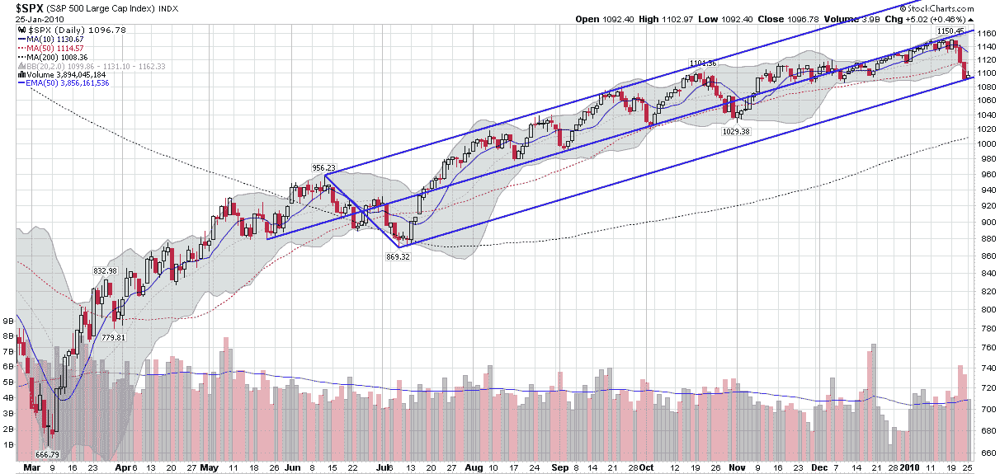

<!--yml
category: 未分类
date: 2024-05-18 17:17:13
-->

# VIX and More: Charting the Selloff with an Andrews Pitchfork

> 来源：[http://vixandmore.blogspot.com/2010/01/charting-selloff-with-andrews-pitchfork.html#0001-01-01](http://vixandmore.blogspot.com/2010/01/charting-selloff-with-andrews-pitchfork.html#0001-01-01)

In yesterday’s [The SPX and an 85 Day Moving Average](http://vixandmore.blogspot.com/2010/01/spx-and-85-day-moving-average.html) I expanded on the use of customized moving averages which are reverse engineered so as to neatly circumscribe past price action.

With a little trial and error, it is possible to craft a moving average that fits prior pullbacks, as is the case with an 85 day moving average and the price action in the SPX since last May.

It just so happens, however, that an off-the-shelf charting tool called an [Andrews Pitchfork](http://vixandmore.blogspot.com/search/label/Andrews%20Pitchfork) neatly captures the price action during the same period and also identifies a price channel and a trend line that have been critical support and resistance levels during the past eight months.

In the chart below, you can see that the Andrews Pitchfork (named for Alan Andrews) is created by starting with a pivot point (I used a May 2009 cycle low) and then projecting a line between that pivot point and the midpoint of the next cycle high and low (here I used the largest pullback to date, the June-July 2009 9.1% selloff). That line, the middle of the three parallel blue lines, is what Andrews called a median line. The flanking parallel lines (“tines”) are created by projecting the distance between the cycle highs and lows forward in time. The result establishes a trend channel and median lines.

Note that all three of the lines in the Andrews Pitchfork have been significant support or resistance levels in the past eight months. The pitchfork shows that through the end of October, the SPX moved in a narrow range between the median line and the upper tine, with the upper tine acting as channel resistance. Since crossing below the median line in December, the SPX hovered just below the median until the markets sold off last week, at which point the SPX moved sharply down to the lower tine. So far the lower tine has held up as support, which has served to reinforce the value of the pitchfork constructed off of the May-July price action.

Of course, the pitchfork also shows the extent to which bullish momentum has slowed and started to reverse in the past week or so. One more sharp break and a close below SPX 1090 is likely to signal an end to the current bullish trend – at least in Andrews Pitchfork terms.

For more on related subjects, readers are encouraged to check out:

 *[source: StockCharts]* 

***Disclosure:*** *none*