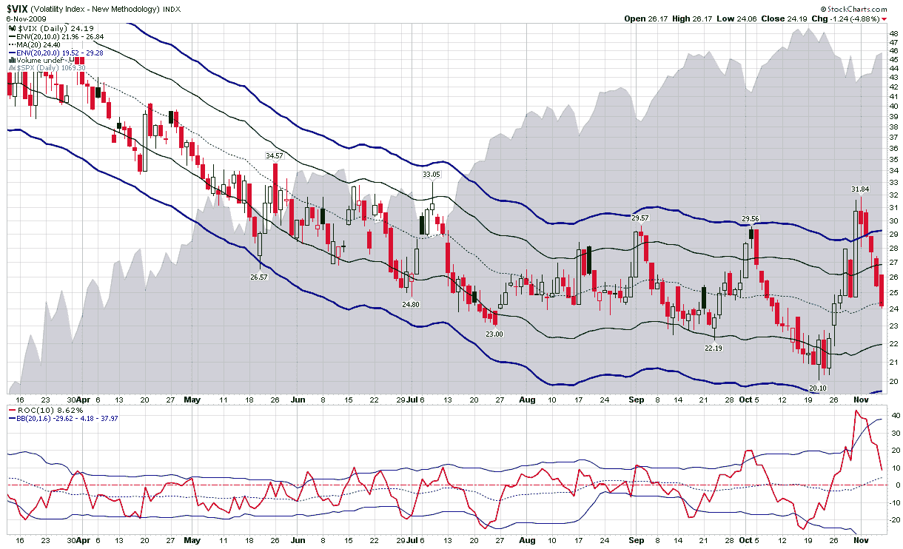

<!--yml
category: 未分类
date: 2024-05-18 17:23:16
-->

# VIX and More: Combining Bollinger Bands and Rates of Change in the VIX

> 来源：[http://vixandmore.blogspot.com/2009/11/combining-bollinger-bands-on-rates-of.html#0001-01-01](http://vixandmore.blogspot.com/2009/11/combining-bollinger-bands-on-rates-of.html#0001-01-01)

As far as I can tell, I have not yet posted about the use of [Bollinger bands](http://vixandmore.blogspot.com/search/label/Bollinger%20bands) in conjunction a [rate of change](http://vixandmore.blogspot.com/search/label/rate%20of%20change) (ROC) indicator to identify volatility breakouts.

In summarizing the action in the VIX over the course of the past two weeks, the chart below captures some of the drama in terms of 10% (solid green) and 20% (solid blue) [moving average envelopes](http://vixandmore.blogspot.com/search/label/moving%20average%20envelopes). In the six month time frame included in the chart, the moving average envelopes flag last week’s [VIX spike](http://vixandmore.blogspot.com/search/label/VIX%20spikes) as the most powerful since stocks turned up in March. The moving averages also indicate that the VIX low of 20.10 from three weeks ago is the second strongest in terms of penetration of the lower moving average envelopes.

The study below the main chart utilizes a 10-day rate of change function as well as Bollinger bands that are tuned to 20 days and 1.6 standard deviations. Note that in this study both the VIX spike and the prior VIX low represent the largest upward and downward moves in terms of magnitude relative to the Bollinger bands.

The rate of change indicator is a valuable way to measure sharp price moves. When combined with the Bollinger band indicator, it is possible to better identify sharp upward and downward moves, particularly when the underlying has a habit of making sudden large moves, as is the case with the VIX.

For additional posts on related subjects, readers are encouraged to check out:

*[source: StockCharts]*