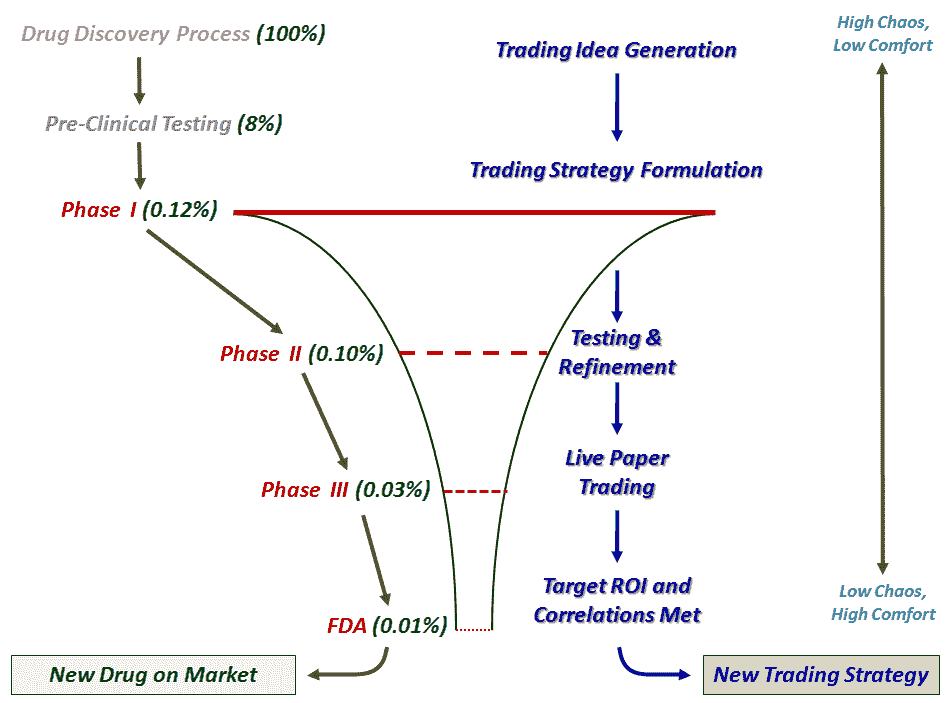

<!--yml
category: 未分类
date: 2024-05-18 17:29:20
-->

# VIX and More: Comfort Zones, Focus and Thinking Like a Biotech Firm

> 来源：[http://vixandmore.blogspot.com/2009/09/comfort-zones-focus-and-thinking-like.html#0001-01-01](http://vixandmore.blogspot.com/2009/09/comfort-zones-focus-and-thinking-like.html#0001-01-01)

In Wednesday’s post, [Kafka, Surrealism and Trading](http://vixandmore.blogspot.com/2009/09/kafka-surrealism-and-trading.html), I talked about the importance of getting out of one’s comfort zone in order to enhance trading. One reader expressed concern that that pushing the envelope too far and straying from one’s comfort zone was an excellent way to learn some expensive lessons and potentially an approach that invites disaster.

The reader makes some excellent points, so let me expand upon and clarify my thinking.

Consider a [biotechnology](http://vixandmore.blogspot.com/search/label/biotech) company as a metaphor for trading and specifically for [trading strategy](http://vixandmore.blogspot.com/search/label/trading%20strategies) development. A biotechnology firm manages a pipeline of drugs in development and in many cases, also has drugs on the market that are generating revenue. Think of the drugs in the pipeline as analogous to investment ideas that the trader is still incubating, testing and deciding whether or not they have sufficient potential to warrant implementing with trading capital.

For drugs in the pipeline, there are various stages of development before the drugs are tested for efficacy and side effects. As drugs progress through the pipeline, they go through internal gated approval processes known formally as Phase 1, Phase 2 and Phase 3 and eventually through an FDA final approval process that determines whether the drug can be sold to the public. Only a small percentage (approximately 8%) of potential new drug ideas make into pre-clinical trials and less than 1% are deemed sufficient to warrant the investment associated with Phase 1 trials. As drugs encounter the gated approval process at the end of each trial phase, the number of high potential candidates is continually winnowed down, as issues related to efficacy or side effects are subjected to rigorous statistical analysis. As these drugs advance through the pipeline, the financial investment increases substantially. Ultimately, only about 1 in 10,000 of the original drugs involved in the drug discovery process makes it all the way through to FDA approval and ends up on the market. On average, the process takes about ten years.

Investors should look at their investment ideas and strategies as a pipeline management process too. There is limited capital available and only the best strategies should be funded. At the beginning of the pipeline, investors should focus the most attention on getting out of their comfort zone, formulating wild new trading ideas and translating these into actionable strategies. This is the best time to get out of one’s comfort zone and embrace some chaos. As the ideas then progress through some sort of internal approval process, then focus become more important. Is the idea robust? Can the idea be translated into effective strategies? Is there enough liquidity to implement these strategies? What will the slippage costs be? What do the initial backtesting results show in terms of potential? Etc.

As new ideas progress through an internal approval process, the trader should move from an area of discomfort to an area of extreme comfort. By the time a trading strategy is ready to be deployed, the trader’s mind set should have evolved from one of high chaos and low comfort to low/no chaos and high comfort. A corollary of the trading idea development process, which I have sketched out in the graphic below, is that the more one is able to get out of their comfort zone at the beginning of the trading idea pipeline, the better the trading results and the more likely there will be uncorrelated strategies when the chaos of idea generation is translated into focused strategies.

For more on trading strategy development, four excellent blogs to follow are:

