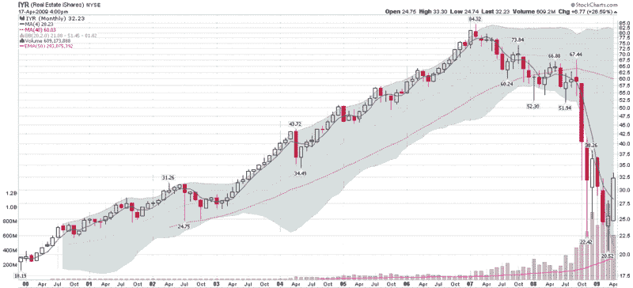

<!--yml
category: 未分类
date: 2024-05-18 17:51:12
-->

# VIX and More: Commercial Real Estate Problems Piling Up

> 来源：[http://vixandmore.blogspot.com/2009/04/commercial-real-estate-problems-piling.html#0001-01-01](http://vixandmore.blogspot.com/2009/04/commercial-real-estate-problems-piling.html#0001-01-01)

Though it gets little in the way of airplay on the blog, real estate happens to be one of my favorite asset classes. It is volatile, can be highly leveraged and also provides what I call “use value,” meaning that it is not necessarily just a piece of paper you hope will appreciate, but can also be tangible property that you can get some enjoyment out of. For the same reason, I would much rather have a [Miró](http://fundaciomiro-bcn.org/index.php?idioma=2) hanging on my wall than an investment in an art ETF.

Getting back to real estate, I theorized in [Waiting for the Next Shoe to Drop](http://vixandmore.blogspot.com/2009/04/waiting-for-next-shoe-to-drop.html) that either credit card debt or [commercial real estate](http://vixandmore.blogspot.com/search/label/commercial%20real%20estate) would be the most likely candidates to usher in the next leg of the financial crisis.

Moody’s [recently reported](http://www.reuters.com/article/companyNewsAndPR/idUSN0150570720090401) that the U.S. credit card charge-off rate rose to a record 8.82% in February and noted that they expect charge-offs to hit a peak of 10.5% during the first half of 2010.

The ticking bomb of commercial real estate may have even more severe consequences as commercial real estate prices continue down over the course of the next few years. A week ago, Fil Zucchi did an excellent job of explaining the problems in commercial real estate at Minyanville in [A Commercial Real Estate Comeback?](http://www.minyanville.com/articles/4/13/2009/index/a/22149) and today he is back with a follow-up piece, [Ten Reasons Why Commercial Real Estate Won’t Rebound](http://www.minyanville.com/articles/4/20/2009/index/a/22256).

There are many ways to play real estate. The double ETFs, [URE](http://vixandmore.blogspot.com/search/label/URE) (+2x) and [SRS](http://vixandmore.blogspot.com/search/label/SRS) (-2x) are a good place to look for trading vehicles. For non-leveraged plays, [IYR](http://vixandmore.blogspot.com/search/label/IYR) offers the best liquidity and an active options market to boot. Given the strength of the recent bounce in real estate stocks (more than 50% off of the recent bottom, as the chart below shows), I would favor the short side at least until I get a better sense of how the commercial real estate story will unfold.

*[source: StockCharts]*

 ****Disclosure****: Short IYR at time of writing.**