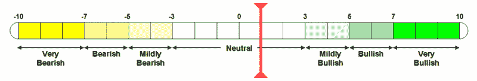

<!--yml
category: 未分类
date: 2024-05-18 15:52:33
-->

# VIX and More: Complacency Creeping Back In; VWSI at +1

> 来源：[http://vixandmore.blogspot.com/2007/03/complacency-creeping-back-in-vwsi-at-1.html#0001-01-01](http://vixandmore.blogspot.com/2007/03/complacency-creeping-back-in-vwsi-at-1.html#0001-01-01)

Quite a few commentators, including [Tim Knight](http://tradertim.blogspot.com/), have pointed out that the VIX has [reversed all of the post 2/27 spike](http://tradertim.blogspot.com/2007/03/give-past-slip.html).  While volatility measures are [subsiding much more rapidly than put to call ratios](http://www.market-harmonics.com/free-charts/sentiment/pcvi.htm), it is safe to say that some investors are thinking that the brief correction has passed and the bull market can now safely resume its course.  In short, some complacency is creeping back into the market, albeit slowly.

The VIX Weekly Sentiment Indicator ([VWSI](http://vixandmore.blogspot.com/search/label/VWSI)) reflects some of this complacency, as it has hugged the 0 mark the past few weeks, currently sitting at +1.

While the VWSI generally seeks to predict VIX movements looking out only 1-2 weeks, this is as good a time as any to remind the reader that longer term [seasonal cycles](http://vixandmore.blogspot.com/search/label/seasonality) are at work as well.  You may never have heard, “Sell in March and go away,” but the March-June period marks the downside cycle of the mid-year “V” pattern in the VIX that I have [commented on earlier](http://vixandmore.blogspot.com/2007/01/month-by-month-look-at-vix.html).

I would not be looking to anticipate volatility spikes at this stage, but I would expect that we will see a few more smaller ones in the coming weeks.  Better yet, be prepared to play a little [Whac-a-Mole](http://en.wikipedia.org/wiki/Whac-A-Mole) and fade these spikes as they occur.  

(Note that in the above temperature gauge, the "bullish" and "bearish" labels apply to the VIX, not to the broader markets, which are usually negatively correlated with the VIX.)

Wine pairing: A while back, a reader had the temerity to suggest that I might want to consider offering a wine pairing with the VWSI. Why not? I've been neglecting my [wine blog](http://zinandpinot.blogspot.com/), so why not jump start the latent oenophile in all of us. For the current +1 reading, coming off of some violent volatility spikes and ushering in the new season, I am recommend a dry [gewurztraminer](http://www.epicurious.com/drinking/wine_dictionary/entry?id=6560). Gewurztraminer is a wine that can stand up to all seasons and all levels of volaltility. It has more personality than any other white wine, is found in more styles and...it's not chardonnay. While the classic version comes from [Alsace](http://www.vinsalsace.com/en/), I am a big fan of several American versions of this wine: dry; off-dry; and the dessert variety. One winery that gets all three versions right is [Navarro](http://www.navarrowine.com/shop/productdetail.php?prodid=546). Last weekend, however, I found a stunning example of dry gewurz off the beaten track in the [Russian River Valley](http://www.rrvw.org/) at [Harvest Moon](http://www.harvestmoonwinery.com/our-wines.html). I hesitate to mention Harvest Moon because it is such a small winery, but the wines are so good that they deserve a wider audience. Enjoy!