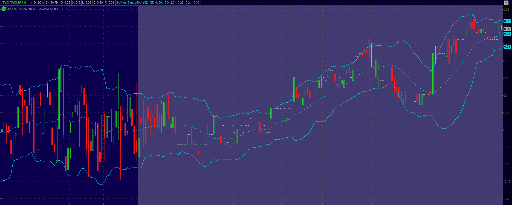

<!--yml
category: 未分类
date: 2024-05-18 16:39:01
-->

# VIX and More: Credit Suisse Suspends Creation Units in TVIX: What It Means

> 来源：[http://vixandmore.blogspot.com/2012/02/credit-suisse-suspends-creation-units.html#0001-01-01](http://vixandmore.blogspot.com/2012/02/credit-suisse-suspends-creation-units.html#0001-01-01)

After today’s regular trading session, Credit Suisse ([CS](http://vixandmore.blogspot.com/search/label/CS)) [announced](http://finance.yahoo.com/news/Credit-Suisse-Temporarily-prnews-3084612990.html?x=0) in a brief press release that it has “temporarily suspended further issuances of the VelocityShares Daily 2x VIX Short-Term ETNs ([TVIX](http://vixandmore.blogspot.com/search/label/TVIX)) due to internal limits on the size of the ETNs.” The company added that “[t]his suspension does not affect the Early Redemption rights of noteholders as described in the pricing supplement.  Other ETNs issued by Credit Suisse are not affected by this suspension.”

The announcement by Credit Suisse raises a lot of questions and I will see what I can do to answer some of the more pressing ones this evening.

While this is all speculation, based on the “internal limits on the size of the ETNs,” it sounds as if the recent exponential growth in TVIX has violated a position size risk control rule relative to the [VIX futures](http://vixandmore.blogspot.com/search/label/VIX%20futures) products that comprise the S&P 500 VIX Short-Term Futures Index ER [excess return] on which TVIX is based. Of course we do not know how much the volatility of those VIX futures products is factored into the position size issue, but given the overhang of events in Europe, China and Iran, I can certainly make the case for a very conservative approach to risk control for any VIX futures exposure at the moment.

The suspension of creation units means that the 40,725,000 shares outstanding represents the upper limit for Credit Suisse. While Credit Suisse describes the action as temporary, there is no particular reason to believe the suspension will be a matter of days. It could possibly be weeks or longer before Credit Suisse agrees to issue new TVIX creation units. Back in 2009, for instance, the United States Natural Gas Fund ([UNG](http://vixandmore.blogspot.com/search/label/UNG)) experienced regulatory approval issues for creation units and suspended new creation units for seven weeks. At one point in time, UNG traded as high as 16% over net asset value, but that premium turned out to be a temporary spike. Suspension of creation units, while unusual, does happen on occasion. Less than two weeks ago, to pick a recent example, Deutsche Bank ([DB](http://vixandmore.blogspot.com/search/label/DB)) [halted creation units](http://www.indexuniverse.com/sections/news/10989-deutsche-suspends-creations-on-7-etns.html) on seven of its commodity ETNs.

The big question for investors is whether the suspension of creation units will mean that TVIX trades at a premium or discount to its net asset value. Given that supply is constrained and demand is not, the most likely scenario is that TVIX will trade at least as high as net asset value or possibly at a premium. Valuation will be highly dependent upon arbitrage opportunities and there are quite a few arbitrage opportunities should TVIX begin to separate from its NAV. VIX futures provide an attractive source of arbitrage firepower, as does the very similar 2x VIX futures ETF, [UVXY](http://vixandmore.blogspot.com/search/label/UVXY), formally known as the ProShares Ultra VIX Short-Term Futures ETF. Arbitrage opportunities are also available via VXX, VIX options as well as options on SPX/SPY, etc.

In terms of the reaction in the markets, we have some after-hours market data to give us an initial sense of the response to the TVIX announcement. TVIX closed the regular session at 17.01 and was last traded at 17.02 when the news crossed the wire and volume spiked. TVIX initially rose a little more than 1% to 17.26, gave back most of those gains, then rose again as high as 17.31 before finishing the after-hours session at 17.28, up 0.27 or 1.6% from the close.

Traders should be aware that each ETP has an [Intraday Indicative Value](http://vixandmore.blogspot.com/search/label/intraday%20indicative%20value) (IV or sometimes IIV), which is essentially a real-time estimate of an ETP’s fair value, based on the most recent prices of its underlying securities. These quotes are updated every 15 seconds and can help determine the extent to which a security has deviated from this measure of fair value. In the graphic below, I have captured the difference between TVIX and TVIX.IV during the last hour of the regular trading session and throughout the (grayed out) after-hours trading session, where TVIX rose to 0.29 above its intraday indicative value.

During tomorrow’s session, keep an eye on TVIX relative to TVIX.IV and also the ratio of TVIX to UVXY. At yesterday’s close, TVIX was trading at a multiple of 2.625 times that of UVXY.

In the short-term, I would expect a small premium to creep in to the price of TVIX, but arbitrage to keep that premium in check. Over the longer term, the price of TVIX will continue to respond to the [Four Key Drivers of the Price of TVIX](http://vixandmore.blogspot.com/2012/02/four-key-drivers-of-price-of-tvix.html) I outlined yesterday, in addition to any market dislocations caused by the suspension of creation units for TVIX.

Should the VIX futures market continue its recent growth trajectory and Credit Suisse ratchet down their relative exposure to that growing market, I would expect to see the resumption of creation units in TVIX in the relatively near future. The timing of this development is difficult to project, as there are quite a few things that can happen in the world of volatility between now and then.

Related posts:

**

*[source(s): thinkorswim/TD Ameritrade]*

***Disclosure(s):*** *short TVIX, VXX and UNG at time of writing*