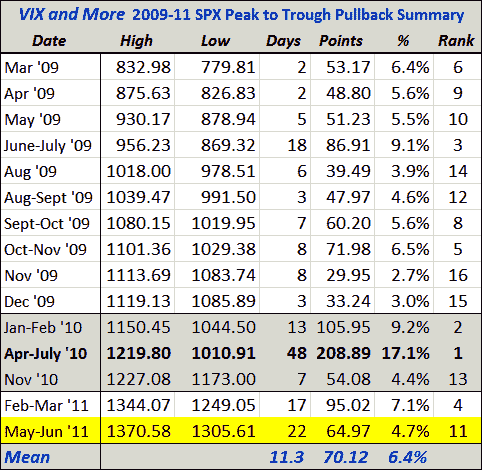

<!--yml
category: 未分类
date: 2024-05-18 16:50:08
-->

# VIX and More: Current SPX Pullback Second Longest Since March 2009 Bull Market Began

> 来源：[http://vixandmore.blogspot.com/2011/06/current-spx-pullback-second-longest.html#0001-01-01](http://vixandmore.blogspot.com/2011/06/current-spx-pullback-second-longest.html#0001-01-01)

Since the current bull market began back in March 2009, I have periodically been posting a table of the most significant pullbacks in the S&P 500 index. With today’s drop down to the 1305, it has now been one full month (22 trading days) since the SPX peaked at 1370\. While the 65 point drop grades out at a pullback of ‘only’ 4.7% (the mean for the 15 pullbacks is 6.5%; the median is 5.6%) it does mark the second longest pullback in terms of peak (May 2^(nd)) to trough (today, assuming 1305 holds) timing.

While long declines are not necessarily steep ones, the longer this market continues to make new one-month lows and has difficulty climbing back into the 1370 range, the more likely this bull market is turning into a sideways move or preparing to reverse downward.

Right now last summer’s 48-day 17.1% decline looks as if it will not be threatened, but a mean decline of 6.5% will take the SPX down to 1281 and a median decline of 5.6% will drop the SPX down to 1294 – and once the index breaks below 1300, all sorts of new scenarios will begin to come in to play.

I still think we will see some buy-on-the-dip activity begin to kick in – as soon as this afternoon – but stocks do appear to be at some sort of inflection point as we await the details of the nonfarm payrolls data.

***Disclosure(s):** none*