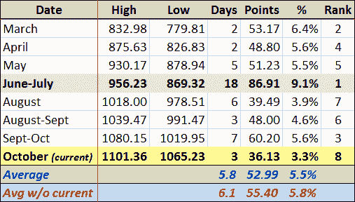

<!--yml
category: 未分类
date: 2024-05-18 17:24:57
-->

# VIX and More: Does the Pullback Have Legs?

> 来源：[http://vixandmore.blogspot.com/2009/10/does-pullback-have-legs.html#0001-01-01](http://vixandmore.blogspot.com/2009/10/does-pullback-have-legs.html#0001-01-01)

With stocks starting to show some signs of stability in the last half hour of trading, the big question on the mind of investors is how far the current pullback is likely to extend.

In order to address this question, I have updated the (surprisingly popular) table I presented at the beginning of the month in [Pullbacks in the 2009 Bull Market](http://vixandmore.blogspot.com/2009/10/pullbacks-in-2009-bull-market.html). The revised table now shows that the pullback which ran from September 23^(rd) to October 2^(nd) resulted in a 5.6% decline from peak to trough, making it the third largest pullback in the S&P 500 index in percentage terms since the beginning of the March rally.

A comparable pullback of 5.6% this time around would put the next bottom in the SPX at 1041\. Using an average of 5.8% for the previous seven pullbacks would establish a target SPX bottom of 1037\. In both scenarios, today’s low represents less than 60% of the expected distance to the target bottom.

So while we may not be putting in a near-term bottom today, a good guesstimate is that the SPX has about 25 points more to fall if it is to keep up with recent historical norms.

