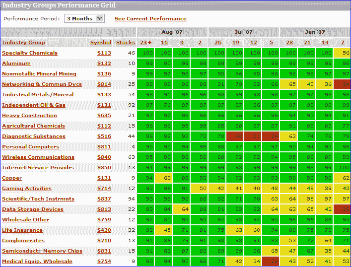

<!--yml
category: 未分类
date: 2024-05-18 19:01:35
-->

# VIX and More: Drilling Down on Sector Performance

> 来源：[http://vixandmore.blogspot.com/2007/08/drilling-down-on-sectors.html#0001-01-01](http://vixandmore.blogspot.com/2007/08/drilling-down-on-sectors.html#0001-01-01)

[Yesterday](http://vixandmore.blogspot.com/2007/08/whats-working-sector-overview_23.html) I talked about sectors in the context of the nine [AMEX Select Sector SPDRs](http://www.sectorspdr.com/aboutspdrs/).  While these are excellent high level buckets for analyzing macro sector performance, when you [lift the hood on these SPDRs](http://www.sectorspdr.com/sectortracker/) (click on any one for details), you jump down to the individual stock level, without the benefit of sub-sectors to analyze.

Fortunately, there are many other excellent free resources where one can drill down on sector performance.  Four great places to start are:

I should probably devote an entire post to [Prophet.net](http://www.prophet.net/), which does many interesting things with sectors.  The tools I find of particular value are [sortable performance](http://www.prophet.net/explore/sectorrankings.jsp) for 214 sectors from 2 days to 5 years; and [historical sector ranks](http://www.prophet.net/explore/sectorPerformance.jsp) from 3 months to 5 years in a helpful graphical format (see below), complete with a drill down capability that pops up the charts for all the individual stocks in a particular sector.  Also, from the I-just-couldn’t-help-myself category, while the pull down menu only allows for a minimum historical performance of 3 months, if you manually edit the URL, you can produce some interesting charts for shorter time frames.  For example, where the URL for the 3 month graphic ends in “…period=3m” it can be edited to “...period=**1**m” to generate a particularly interesting one month historical chart.  Try it!

MarketGauge.com has an industry group [summary](http://tal.marketgauge.com/PHS2/PHS.asp?t=1&k=11&v=3&s=104&sm=2&pg=1&amp;amp;amp;amp;amp;amp;z=10&c=fnd&e=prv_phstoday) that is an excellent graphical tool covering multiple time frames, but also offers four fundamental analysis options for analyzing the top and bottom sectors.  I particularly like a feature they have that highlights the [stocks driving the strongest/weakest groups higher](http://tal.marketgauge.com/MGHome/PHSReportsIndex.asp) and a perhaps even more valuable [leading stocks in today’s top groups](http://tal.marketgauge.com/PHS2/PHS.ASP?t=1&k=40&v=4&sm=1&s=104&pg=1&amp;amp;amp;amp;amp;amp;z=100&fq=1&a=5&spn=spTblBldTopStocksTopGroupsFast&spp=5,100,100000&x=Leading*Stocks*In*Todays*Top*Groups&amp;amp;amp;amp;amp;c=fnd&e=fnd_ranks) page that includes fundamental data and charts on one handy page.

For a different take on sector performance and momentum, you might want to try [ETFInvestmentOutlook.com](http://www.etfinvestmentoutlook.com/).  Two of their features that I get the most use out of are the [McClellan breadth ETF rankings](http://www.etfinvestmentoutlook.com/rank_breadth_advance_decline_d.php) and the [high-low breadth ETF rankings](http://www.etfinvestmentoutlook.com/rank_breadth_new_highs_lows_avg_d.php).

In addition to the above, there are a number of interesting sector-related heat maps available, including two sites of particular note:

Finally, in the event that you have not been there in awhile, Yahoo has beefed up their [Industry Center](http://biz.yahoo.com/ic/index.html) a little.  A good place to start surfing there is in the [leaders and laggards](http://biz.yahoo.com/ic/l/pip.html) section.