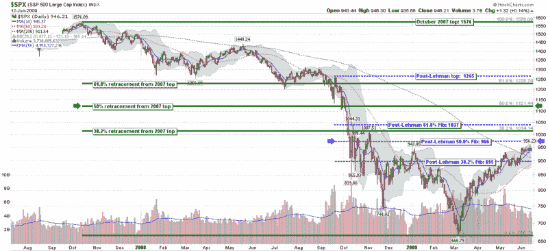

<!--yml
category: 未分类
date: 2024-05-18 17:43:04
-->

# VIX and More: Dueling Fibonaccis for the SPX

> 来源：[http://vixandmore.blogspot.com/2009/06/dueling-fibonaccis-for-spx.html#0001-01-01](http://vixandmore.blogspot.com/2009/06/dueling-fibonaccis-for-spx.html#0001-01-01)

I had suspected that I might get some pushback from some of the charting purists about limiting the scope of my [Fibonacci](http://vixandmore.blogspot.com/search/label/Fibonacci) retracement lines to a post-Lehman world, particularly since the SPX had already corrected more than 300 points prior to the Lehman Brothers bankruptcy filing.

My explanation, quite simply, is that the investment world changed radically in September 2008, both from a fundamental and technical perspective. I even used the term [Market 2.0](http://vixandmore.blogspot.com/2008/09/market-20.html) to describe the situation at that time. Technically, at that time the markets transitioned from a measured decline to a series of free falls that took ten day historical volatility to as high as 100 in October.

In the chart below, I have superimposed two different sets of Fibonacci retracements on top of almost two years of daily SPX data. The dotted blue lines repeat my post-Lehman world view as presented in [SPX and Fibonacci Resistance at 966](http://vixandmore.blogspot.com/2009/06/spx-and-fibonacci-resistance-at-966.html) earlier today; the solid green lines reflect a more traditional approach to Fibonacci calculations, using the October 2007 high of 1576 as a point of departure. I have highlighted the 50% retracement levels for both sets of calculations, using blue arrows for the post-Lehman data and green arrows for the data going back to 2007\. Note that the difference is a full 155 points: 966 in a post-Lehman world and 1121 using the 2007 high.

If the markets continue to rally, I would encourage readers to pay attention to the green Fibonacci lines. In the meantime, I continue to believe that the post-Lehman period – at least while the SPX remains below 1000 – is the appropriate time frame on which to focus our analytical lens.

*[source: StockCharts]*