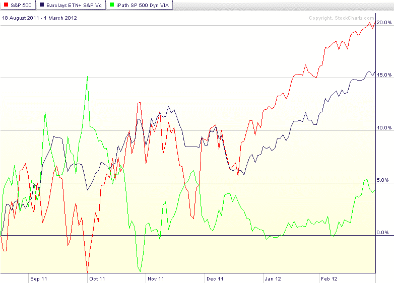

<!--yml
category: 未分类
date: 2024-05-18 16:37:29
-->

# VIX and More: Dynamic VIX ETPs as Long-Term Hedges

> 来源：[http://vixandmore.blogspot.com/2012/03/dynamic-vix-etps-at-long-term-hedges.html#0001-01-01](http://vixandmore.blogspot.com/2012/03/dynamic-vix-etps-at-long-term-hedges.html#0001-01-01)

With the huge [contango](http://vixandmore.blogspot.com/search/label/contango) in the [VIX futures](http://vixandmore.blogspot.com/search/label/VIX%20futures) [term structure](http://vixandmore.blogspot.com/search/label/term%20structure) at the moment, anyone who is buying [VIX options](http://vixandmore.blogspot.com/search/label/VIX%20options) or the [VIX exchange-traded products](http://vixandmore.blogspot.com/search/label/VIX%20ETN) (ETPs) right now is having to pay for that contango in order to have the opportunity to capitalize on increasing volatility. With the contango-based negative [roll yield](http://vixandmore.blogspot.com/search/label/roll%20yield) currently running at 15% *per month*, this means the cost of a volatility [hedge](http://vixandmore.blogspot.com/search/label/hedging) for long equity positions is extremely expensive in the current market.

Fortunately, investors do have some alternatives that have a different type of appeal.

There are two VIX ETPs, [VQT](http://vixandmore.blogspot.com/search/label/VQT) and [XVZ](http://vixandmore.blogspot.com/search/label/XVZ), which attempt to minimize the impact of the negative roll yield by using a market timing mechanism that dynamically adjusts the long volatility exposure. In more volatile markets, the exposure increases; in less volatile markets, the long volatility exposure is either very low (in the case of VQT) or can even flip to a small net short position (in the case of XVZ).

VQT is more of a portfolio replacement strategy, while XVZ is more of a portfolio augmentation strategy. Specifically, VQT has long SPY exposure that ranges from 60% to 97.5% of its portfolio, with the balance (2.5% - 40%) allocated to a long position in the VIX short-term futures (think [VXX](http://vixandmore.blogspot.com/search/label/VXX)). The links below will provide more details.

XVZ, on the other hand, does not hold any long equity component, only short-term (again, think VXX) and mid-term (think [VXZ](http://vixandmore.blogspot.com/search/label/VXZ)) VIX futures. The twist here is that while the mid-term VIX futures component can range from 50-100% of the portfolio, the short-term component can be as high as 50%, but as low as *negative* 30%. So…under certain circumstances (e.g., a very steep VIX futures term structure, like the one we are currently experiencing), the portfolio will consist of the equivalent of a 30% short position in VXX and a 70% long position in VXZ. On balance, that type of portfolio should be very close to volatility neutral and in some cases even have a slight short volatility bias.

Since XVZ was only launched on August 18, 2011 (VQT dates back to September 2010), I have chosen a graphic that shows the relative performance of the SPX (red line), VQT (blue line) and XVZ (green line) from the launch of XVZ to the present. Note that with its long exposure, VQT is better able to take advantage of a low volatility slow bull market. XVZ, on the other hand, is generally close to flat in a low volatility bull market, but should the VIX spike sharply higher, XVZ will likely do a better job of capitalizing on the volatility spike.

As investors ponder the fatigued bulls and inevitable pullback sometime in the near future, certainly VQT and XVZ warrant a more detailed investigation, along with some of the non-volatility ETPs that are meant to reduce risk and hedge against a downturn, such as [VSPY](http://vixandmore.blogspot.com/search/label/VSPY), [SPLV](http://vixandmore.blogspot.com/search/label/SPLV), and others.

Related posts:

**

*[source(s): StockCharts.com]*

 ****Disclosure(s):*** *long XVZ and short VXX at time of writing**