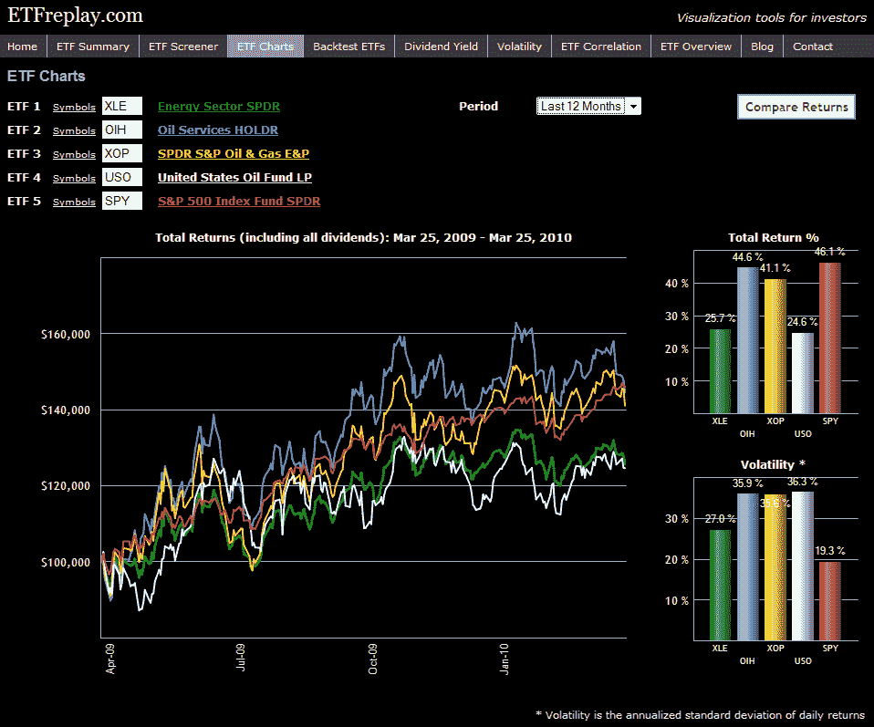

<!--yml
category: 未分类
date: 2024-05-18 17:12:56
-->

# VIX and More: ETFreplay.com Brings ETFs, Volatility and Charts Together Under One Roof

> 来源：[http://vixandmore.blogspot.com/2010/03/etfreplaycom-brings-etfs-volatility-and.html#0001-01-01](http://vixandmore.blogspot.com/2010/03/etfreplaycom-brings-etfs-volatility-and.html#0001-01-01)

As a full-time investor and part-time blogger, I have a weakness for web sites that focus on ETFs, volatility and charts – three of the subjects I feature prominently in this space. For this reason, I was excited when [ETFreplay.com](http://etfreplay.com/) appeared on the scene earlier this year specializing in ETFs, offering some unique and compelling graphics, and demonstrating an interest in volatility.

The site is still evolving, but is already a fun an informative destination, particularly for investors who are interested in ETFs. Some of the functionality currently offered includes screening, back testing, correlations, charting, etc. There is also a [blog](http://etfreplay.com/blog/) which provides graphics and commentary on a number of issues related to ETFs. The content is excellent, but the graphics are what inspired the tagline, “Visualization tools for investors.” I have included one example graphic below in which I decided to compare the performance and volatility of four popular energy ETFs ([XLE](http://vixandmore.blogspot.com/search/label/XLE), [OIH](http://vixandmore.blogspot.com/search/label/OIH), [XOP](http://vixandmore.blogspot.com/search/label/XOP) and [USO](http://vixandmore.blogspot.com/search/label/USO)) relative to the S&P 500 ETF (SPY) over the course of the past year. I'll let the chart speak for itself.

In my opinion, there only a handful of top tier ETF web sites out there. While it may still be a little too early to add ETFreplay.com to that list, based on the speed at which the site is improving, I suspect it will not be long before that gap is closed.

For more on related subjects, readers are encouraged to check out:

*[source: ETFreplay.com]* 

***Disclosure(s):*** *long XOP at time of writing*