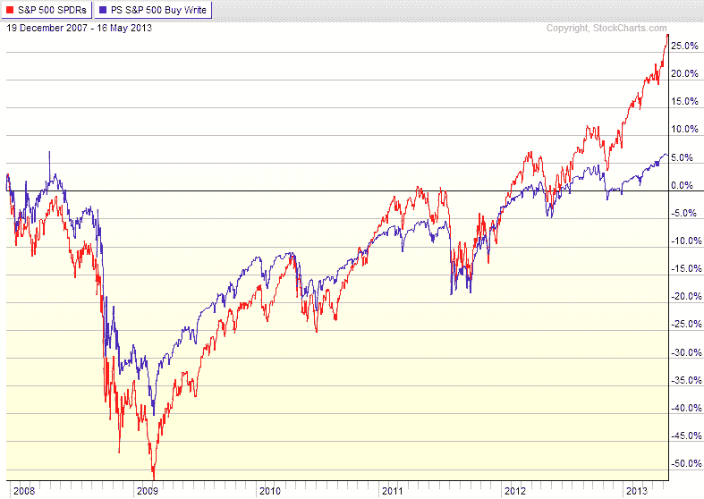

<!--yml
category: 未分类
date: 2024-05-18 16:16:38
-->

# VIX and More: ETPs Turn to Selling Options to Generate Income

> 来源：[http://vixandmore.blogspot.com/2013/05/etps-turn-to-selling-options-to.html#0001-01-01](http://vixandmore.blogspot.com/2013/05/etps-turn-to-selling-options-to.html#0001-01-01)

Not long after I penned [The Options and Volatility ETPs Landscape](http://vixandmore.blogspot.com/2013/02/the-options-and-volatility-etps.html), Credit Suisse ([CS](http://vixandmore.blogspot.com/search/label/CS)) added another [buy-write](http://vixandmore.blogspot.com/search/label/buy-write) / [covered call](http://vixandmore.blogspot.com/search/label/covered%20calls) ETP to the mix: the Credit Suisse Silver Shares Covered Call ETN ([SLVO](http://vixandmore.blogspot.com/search/label/slvo)).

With SLVO, Credit Suisse is essentially extending the methodology they pioneered with the Credit Suisse Gold Shares Covered Call ETN ([GLDI](http://vixandmore.blogspot.com/search/label/GLDI)). In the case of both GLDI and SLVO, the ETPs are selling covered calls against the underlying [commodity](http://vixandmore.blogspot.com/search/label/commodities) ETF for gold ([GLD](http://vixandmore.blogspot.com/search/label/GLD)) and silver ([SLV](http://vixandmore.blogspot.com/search/label/SLV)) in an effort to generate some income, and in so doing, choosing to forego some upside potential. In both instances, the ETP starts selling covered calls with 39 days until expiration and completes the sales with 35 days to expiration. One month later, the ETP buys these covered calls back over a period ranging from five to nine days prior to expiration. The net proceeds of these covered call transactions are then paid out as a monthly dividend. This dividend payment is not guaranteed and can fluctuate substantially from month to month. In the first four months following its launch, the monthly dividend for GLDI has been 0.1146, 0.0724, 0.1319 and 0.0572.

As silver is generally much more volatile than gold, SLVO elects to sell calls that are 6% out-of-the-money, while GLDI sells calls that are only 3% OTM. Other than this difference in strike selection or moneyness, the strategies employed by GLDI and SLVO are essentially the same.

Of course, covered call strategies work best when the price of the underlying is flat or when the underlying is appreciating slowly. During the recent sharp drop in GLD and SLV, the covered calls did provide a small amount of downside protection, but with GLD falling 13% over the course of just two trading days last month, the downside protection offered by a covered call was barely more than a rounding error. Covered calls and buy-write strategies generally outperform a long position in the underlying in all instances except when the underlying experiences a strong bull move.  (See graphic below for details.)

Thinking more broadly, the introduction of GLDI and SLVO should reinforce the idea that with ETPs now spanning a wide variety of asset classes and alternative investments, covered call strategies can be implemented in many non-traditional ways. The most popular of the traditional methods is PowerShares S&P 500 BuyWrite ([PBP](http://vixandmore.blogspot.com/search/label/PBP)), which sells covered calls against the popular equity index. There is no reason, however, why there cannot be a similar product that sells covered calls against more volatile groups or sectors, such as emerging markets ([EEM](http://vixandmore.blogspot.com/search/label/EEM)), small caps ([IWM](http://vixandmore.blogspot.com/search/label/IWM)) or semiconductors ([SMH](http://vixandmore.blogspot.com/search/label/SMH)), just to name a few. One can even bring alternative assets under the covered call tent. I’m not talking just about the likes of [crude oil](http://vixandmore.blogspot.com/search/label/crude%20oil), [copper](http://vixandmore.blogspot.com/search/label/copper) or [corn](http://vixandmore.blogspot.com/search/label/corn), but why not have covered calls on real estate, currencies or even volatility ETPs?

Better yet, why stop at covered calls? A strategy that I have discussed here on a number of occasions is selling cash-secured puts. The recent launch of U.S. Equity High Volatility Put Write Index ETF ([HVPW](http://vixandmore.blogspot.com/search/label/HVPW)) brought the [put-write](http://vixandmore.blogspot.com/search/label/put-write) strategy into the ETP marketplace.  It is unfortunate that put-write strategies have not found a wider audience at this point or they too would be ripe for extending beyond the comfortable confines of the S&P 500 index.

Assuming this market eventually stops going up almost every day, investors are going to have to look for other ways to grow their portfolio and the scramble for yield will no doubt intensify. With ETPs now selling options to generate income, investors may want to look at some of the shrink-wrapped products mentioned above or consider how they might wish to implement similar strategies on their own.

*[source(s): StockCharts.com]*

Related posts:

***Disclosure(s):*** *long GLDI and HVPW at time of writing*