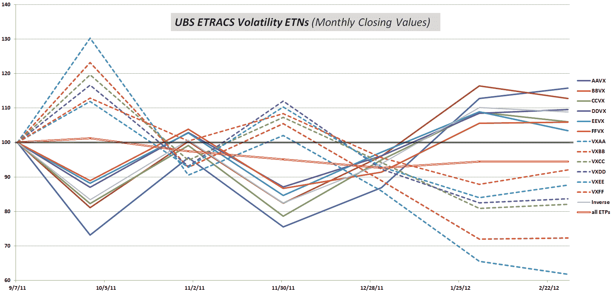

<!--yml
category: 未分类
date: 2024-05-18 16:37:54
-->

# VIX and More: ETRACS Volatility ETPs

> 来源：[http://vixandmore.blogspot.com/2012/02/etracs-volatility-etps.html#0001-01-01](http://vixandmore.blogspot.com/2012/02/etracs-volatility-etps.html#0001-01-01)

While the likes of [TVIX](http://vixandmore.blogspot.com/search/label/TVIX) and [UVXY](http://vixandmore.blogspot.com/search/label/UVXY) have become overnight sensations during the last few weeks, one group of [VIX exchange-traded products](http://vixandmore.blogspot.com/search/label/VIX%20ETN) (ETPs) that continues to toil in relative obscurity is the dozen ETRACS VIX ETN that [UBS](http://vixandmore.blogspot.com/search/label/UBS) launched in September 2011.

The ETRACS products are simple in their conception: they are based on the [VIX futures](http://vixandmore.blogspot.com/search/label/VIX%20futures) and include both long and inverse products with target weighted average maturities of 1 month, 2 months, 3 months, 4 months, 5 months and 6 months. The tickers are straightforward as well: [VXAA](http://vixandmore.blogspot.com/search/label/VXAA) for the 1month long product, with [AAVX](http://vixandmore.blogspot.com/search/label/AAVX) for the 1 month inverse product; [VXBB](http://vixandmore.blogspot.com/search/label/VXBB) for the 2 month long product, with [BBVX](http://vixandmore.blogspot.com/search/label/BBVX) for the 2 month inverse product; etc.

In essence, the ETRACS volatility products have the potential to allow investors in a standard brokerage account the ability to be long or short almost any portion of the VIX futures curve without having to trade in a futures account and deal with the additional regulatory, margin and other complexities of maintaining a futures account.

In practice, the ETRACS products have found a limited audience. The total volume across all twelve produces was less than 10,000 shares today and unfortunately that is a typical trading day for the ETRACS suite.

Even if you elect not to trade any of the ETRACS volatility ETPs, studying their price movements can yield a fair amount of insight. All were first traded on September 8, when the VIX was trading at about 34\. In the intervening period, all the long VIX products have lost ground (from -8% to -38%, depending upon target maturity), while all the inverse products have made money (from +5.9% to +15.8%, depending upon target maturity), as shown in the graphic below. Due largely to the ravages of [term structure](http://vixandmore.blogspot.com/search/label/term%20structure) and negative [roll yield](http://vixandmore.blogspot.com/search/label/roll%20yield), the losses have been larger than the gains and the mean performance across all twelve ETPs (solid bright red line) has been a loss of 5.6% during the five months and twenty days since these products were launched.

Should these ETRACS product turn out to have a long life (and they will likely need a lot more fans if this is going to be the case), then they will paint a fascinating picture of the evolving VIX term structure and the consequences of negative and positive roll yield. As it is now, even the short-lived mirror image lines tell a story that is worth paying attention to.

Related posts:

**

*[source(s): Yahoo]*

***Disclosure(s):*** *long BBVX;short TVIX and UVXY at time of writing*