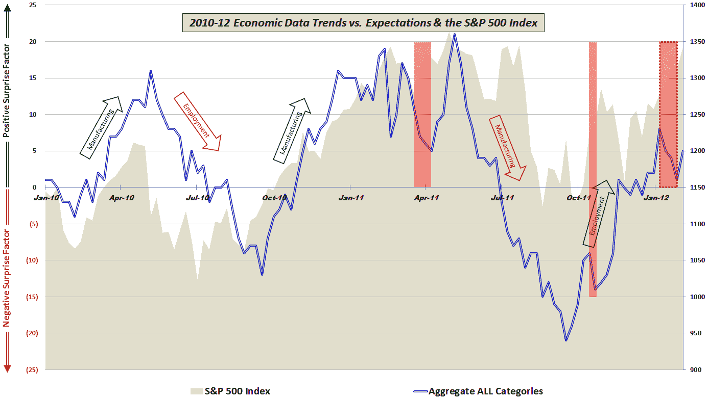

<!--yml
category: 未分类
date: 2024-05-18 16:41:17
-->

# VIX and More: Economic Data: Divergence or Confirmation for Stocks?

> 来源：[http://vixandmore.blogspot.com/2012/02/economic-data-divergence-or.html#0001-01-01](http://vixandmore.blogspot.com/2012/02/economic-data-divergence-or.html#0001-01-01)

The last time I checked in on the performance of U.S. economic data relative to expectations, some two months or so ago, I observed:

> *“One could certainly make the case that data underperformed stocks from April to September, but has been outperforming stocks for the last 2 ½ months.*
> 
> *While conventional wisdom says that stocks lead economic fundamentals for 6-9 months, this graphic does not support that idea. Instead, it will be interesting to see which of the two assumes a leading role now that at least some of the European angst appears to be in the rear view mirror.”*

With the benefit of hindsight, clearly the stocks have been in the driver’s seat and to some extent, the increase in stock prices has had a positive effect on the economic data. For the better part of January, there was a substantial divergence (see dotted red box in graphic below) between stocks and economic data, with stocks in a marked uptrend, while economic data were falling short of consensus expectations on a regular basis.

It is possible that last week’s [nonfarm payroll](http://vixandmore.blogspot.com/search/label/nonfarm%20payrolls) data and [ISM](http://vixandmore.blogspot.com/search/label/ISM) services index marked a turning point in the performance of economic data relative to expectations, yet it is also clear that the data trend still lags the stock price trend by a significant margin.

For this update, I have annotated the graphic with arrows to show where manufacturing and [employment](http://vixandmore.blogspot.com/search/label/employment) have been the economic underpinnings of a rise in stocks. This time around the employment data seem to be moving in the right direction, but manufacturing has had trouble living up to expectations – at least for the past two months.

*[Readers who are interested in more information on the component data included in this graphic and the methodology used are encouraged to check out the links below. For those seeking more details on the specific economic data releases which are part of my aggregate data calculations, check out* [*Chart of the Week: The Year in Economic Data (2010)*](http://vixandmore.blogspot.com/2011/01/chart-of-week-year-in-economic-data.html)*.]*

Related posts:

**

*[sources: various]*

***Disclosure(s):*** *none*