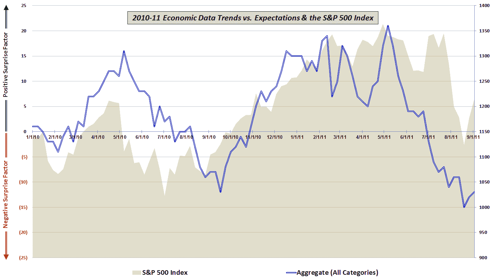

<!--yml
category: 未分类
date: 2024-05-18 16:48:36
-->

# VIX and More: Economic Data Not Supporting Gloom and Doom Forecasts – At Least for Now

> 来源：[http://vixandmore.blogspot.com/2011/08/economic-data-not-supporting-gloom-and.html#0001-01-01](http://vixandmore.blogspot.com/2011/08/economic-data-not-supporting-gloom-and.html#0001-01-01)

For over a year I have been examining how economic data in the United States has been faring relative to expectations and have been posting graphics that show the trends in five groups (manufacturing/general, housing/construction, employment, consumer and prices/inflation) in order to get a better sense of which pockets in the economy have been exceeding expectations and which have been lagging. *[For the detailed graphics see links 2-8 below.]*

The last time around ([Economic Data vs. Expectations and Stock Prices](http://vixandmore.blogspot.com/2011/06/economic-data-vs-expectations-and-stock.html), June 2, 2011) I elected to switch to a graphic which aggregated the data across all five categories in order to drive home the main point, which was that the economic reports were consistently missing expectations, sometimes by a wide margin, even though stock prices seemed to be largely treading water. Stocks held on for another few weeks, but ultimately they began to act like the data – as if they had an anchor tied to their ankle.

[Today’s consumer confidence data](http://www.conference-board.org/data/consumerconfidence.cfm) was another big miss, but the trend for the last two weeks has been one of data that is slightly better than expected. At the very least there are some signs that the deluge of bearish data which began in early May ran its course during the third week in August. Whether this is just a pause before the August swoon begins to show its impact in next month’s data remains to be seen, but for now at least the data show slowing growth. Call it partly cloudy and a chance of gloom.

Finally, I cannot help but wonder aloud once again about the old dictum that the stock market looks not at the current economic environment, but at what conditions are expected to be in about 6-9 months. In the chart below it appears that for the better part of the past year, stocks have been more of a simultaneous reflection of current data than a predictor of what may lie down the road.

Readers who are interested in more information on the details of the economic data included in this graphic and the methodology used are encouraged to check out the links below. For those seeking more details on the specific economic data releases which are part of my aggregate data calculations, check out [Chart of the Week: The Year in Economic Data (2010)](http://vixandmore.blogspot.com/2011/01/chart-of-week-year-in-economic-data.html).

Related posts:

***Disclosure(s):*** *none*

*[sources: various]*