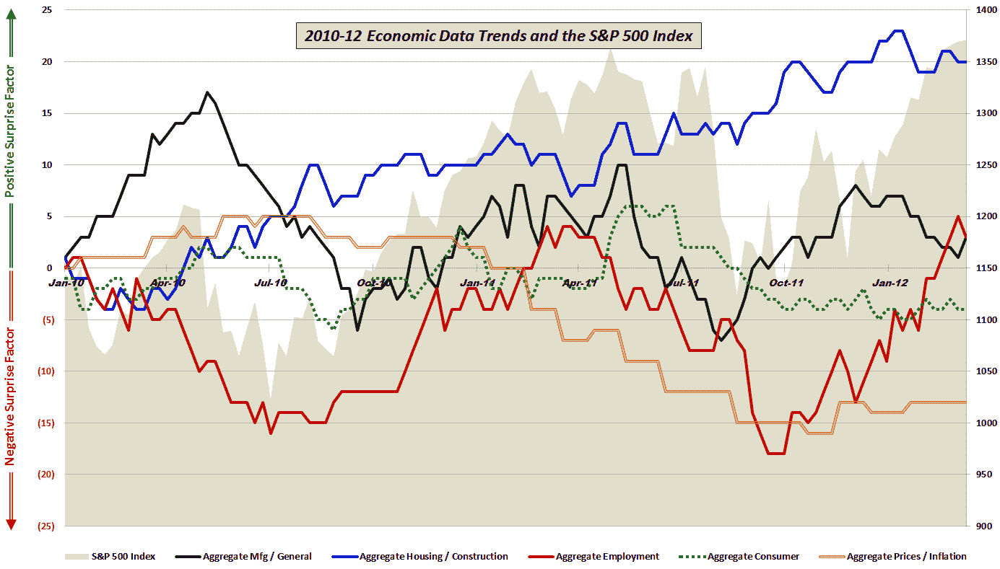

<!--yml
category: 未分类
date: 2024-05-18 16:36:16
-->

# VIX and More: Economic Data vs. Expectations: Stocks and Employment Data Rallying Since October

> 来源：[http://vixandmore.blogspot.com/2012/03/economic-data-vs-expectations-stocks.html#0001-01-01](http://vixandmore.blogspot.com/2012/03/economic-data-vs-expectations-stocks.html#0001-01-01)

Five weeks ago, in [Economic Data: Divergence or Confirmation for Stocks?](http://vixandmore.blogspot.com/2012/02/economic-data-divergence-or.html) I looked at some of the disappointing January economic numbers and wondered if these were outliers that the market should ignore or an indication that the economy was losing some strength.

In that February analysis I noted:

> *“For this update, I have annotated the chart to show where manufacturing and [employment](http://vixandmore.blogspot.com/search/label/employment) have been the economic underpinnings of a rise in stocks. This time around the employment data seem to be moving in the right direction, but manufacturing has had trouble living up to expectations – at least for the past two months.”*

With the benefit of some additional hindsight, it appears that the employment situation is even stronger than originally anticipated. In fact, looking back to the bottoming in stocks in early October, the improving employment situation which dates from that same period has coincided almost perfectly with an improving stock market. On the other hand, manufacturing and broader economic activity data have missed expectations more than they have exceeded them since the beginning of December – a trend stocks have continued to ignore.

The graphic below evaluates economic data relative to expectations across five groups of economic activity (manufacturing/general, housing/construction, employment, consumer and prices/inflation) and plots the relative level of positive and negative surprises in each category against the performance of S&P 500 index going back to the beginning of 2010.

One year ago the employment gains relative to expectations were just about peaking, while manufacturing would continue to post positive surprises for another two months or so. As expectations for the employment market ratchet upward in 2012, is it possible for the data to continue to deliver more bullish surprises?

*[Readers who are interested in more information on the component data included in this graphic and the methodology used are encouraged to check out the links below. For those seeking more details on the specific economic data releases which are part of my aggregate data calculations, check out* [*Chart of the Week: The Year in Economic Data (2010)*](http://vixandmore.blogspot.com/2011/01/chart-of-week-year-in-economic-data.html)*.]*

Related posts:

******

***Disclosure(s):*** *none*

*[sources: various]*