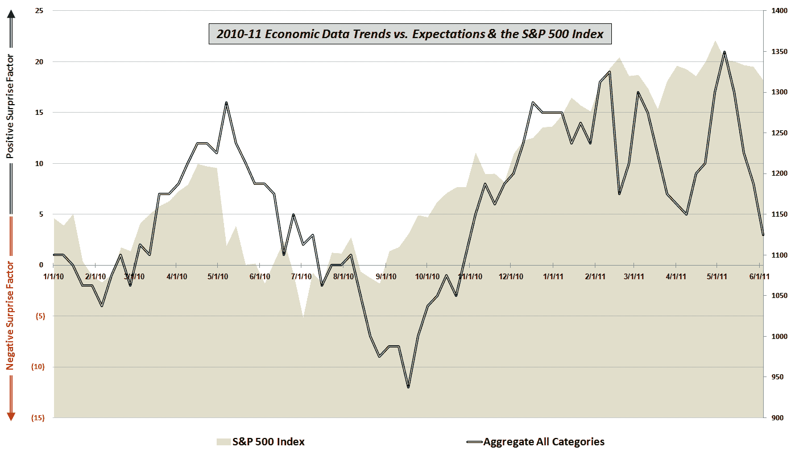

<!--yml
category: 未分类
date: 2024-05-18 16:49:57
-->

# VIX and More: Economic Data vs. Expectations and Stock Prices

> 来源：[http://vixandmore.blogspot.com/2011/06/economic-data-vs-expectations-and-stock.html#0001-01-01](http://vixandmore.blogspot.com/2011/06/economic-data-vs-expectations-and-stock.html#0001-01-01)

For the last year I have been posting charts of the trends in various economic data reports versus consensus expectations. The last time around, in [Continued Lackluster Data vs. Expectations](http://vixandmore.blogspot.com/2011/04/continued-lackluster-economic-data-vs.html), I commented that the April data indicated “manufacturing and employment are no longer providing positive surprises relative to expectations, while data related to the consumer reflect consumer activity that is plodding at best.”

After a several weeks of positive surprises, the trend has been one of consistently missing expectations over the course of the last four weeks. In fact, the four weeks leading up to tomorrow’s employment report is the worst four week stretch relative to expectations since I began tabulating the data in this format at the beginning of 2010.

In order to focus on the big picture trend, this time around I have elected not to break out the data into five groups (manufacturing/general, housing/construction, employment, consumer and prices/inflation) as I have done in the past. Instead, the chart below shows just the aggregate data relative to expectations plotted against the SPX on a weekly basis, going back to the beginning of 2010.

To some extent the chart shows stock prices and data surprises have been highly correlated over the course of the past 1 ½ years, with a very minor lag time, if any. Not surprisingly, the recent data trend has been down sharply. It remains to be seen whether this is a temporary hiccup as the full extent of the Japan disruption is revealed or whether the global economy now has some large structural headwinds. Certainly the recent decoupling of data and stocks is unusual – and may come to a head tomorrow morning.

Readers who are interested in more information on the details of the economic data included in this graphic and the methodology used are encouraged to check out the links below.

Related posts:

***Disclosure(s):*** *none*