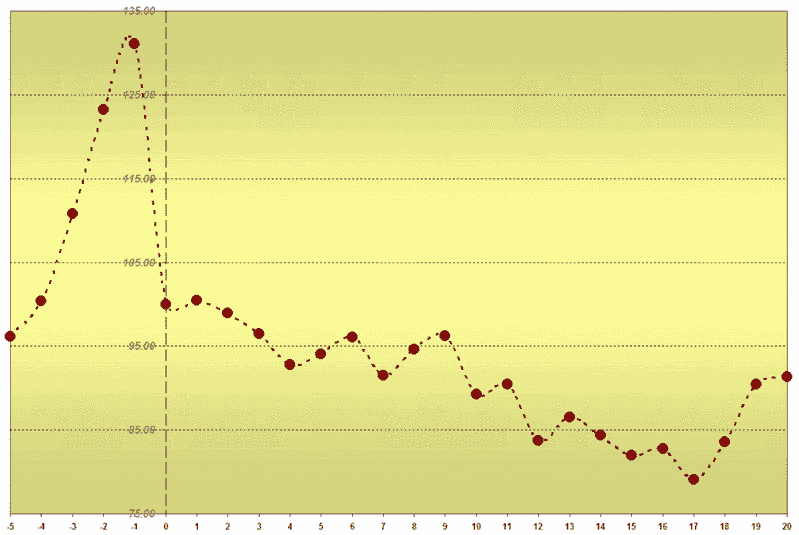

<!--yml
category: 未分类
date: 2024-05-18 15:55:34
-->

# VIX and More: Elast-o-VIX

> 来源：[http://vixandmore.blogspot.com/2007/03/elast-o-vix_07.html#0001-01-01](http://vixandmore.blogspot.com/2007/03/elast-o-vix_07.html#0001-01-01)

The events of last week gave us an opportunity to [examine](http://vixandmore.blogspot.com/2007/03/vix-spikes-and-echo-volatility.html) what happens when the VIX spikes 30% or more in one day.  For the most part, the conclusion was that spikes of this magnitude generally represent a near-term VIX top; save some [echo volatility](http://vixandmore.blogspot.com/search/label/echo%20volatility) spikes, they also indicate that the VIX should trend down from a large spike.

We are in uncharted territory once again this week, this time with the mean-reversion engine working overtime to snap the VIX back down from the low 20s to 15.  In an unprecedented move, the VIX fell over 15% twice within five trading days, dropping 16% on 2/28 and 19% yesterday.  Interestingly, the last time two 15% drops fell in reasonably close proximity was in June 2006, when they were ten days apart.  Prior to that, there were only nine 15% drops in the previous 17 years and only two of those occurred in the decade leading up to the events of last June.

At one point yesterday, the VIX was down 20%.  While it edged away from that number by the end of the trading day, I thought it might be instructive to look at the only three times in VIX history that it has fallen 20% in one day: 9/22/93; 4/15/94; and 6/15/06.

For those who are not familiar with the [composite historical graphs](http://vixandmore.blogspot.com/search/label/composite) I have included here in the past, the chart below takes the three data points above and normalizes the aggregate end of day values at 100 for the day in which the VIX fell 20% (also indicated with a “0” on the X axis and a vertical dashed line through it.)  Here I have included the aggregate pricing data for the five days leading up to the 20% VIX drop (-5 to -1) and the twenty days immediately following the drop (1 to 20.)

The graph itself should tell the rest of the story.  Personally, I found it most interesting that the 20% VIX drop was – at least in this historical context – a mean-reverting reaction that reversed three days of increasing volatility rather than striking out in a new direction.  Interesting perhaps, but not surprising, as it is consistent with one of the [recurring themes](http://vixandmore.blogspot.com/2007/02/one-day-20-spikes-in-vix.html) in this blog.

