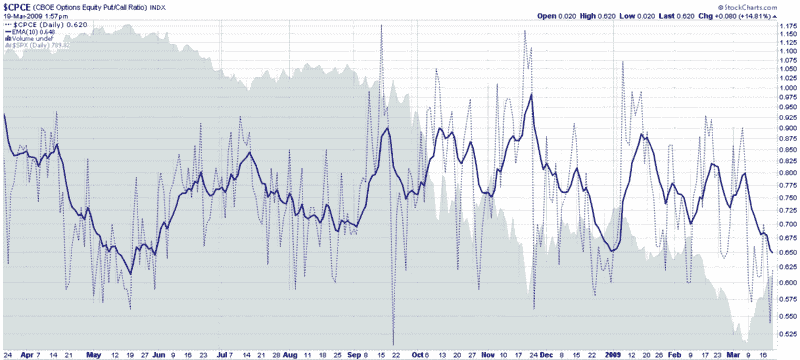

<!--yml
category: 未分类
date: 2024-05-18 17:54:50
-->

# VIX and More: Equity Put to Call Ratio Hits Ten Month Low

> 来源：[http://vixandmore.blogspot.com/2009/03/equity-put-to-call-ratio-hits-ten-month.html#0001-01-01](http://vixandmore.blogspot.com/2009/03/equity-put-to-call-ratio-hits-ten-month.html#0001-01-01)

At the moment it is not at all difficult to find an indicator that believes stocks are overbought, at least on a short-term basis.

Of the many out there, I choose to highlight the CBOE’s equity ratio ([CPCE](http://vixandmore.blogspot.com/search/label/CPCE)), which, along with the [ISEE](http://vixandmore.blogspot.com/search/label/ISEE), is one of my two favorite [put to call](http://vixandmore.blogspot.com/search/label/put%20to%20call) ratios.

In the chart below, there is ample evidence of low levels of put activity compared to call activity at the CBOE. The daily data are represented by the dotted blue lines; I also use a 10 day exponential moving average to smooth the data over a two week period. I find that the 10 day EMA gives excellent contrarian signals. The most recent low in the 10 day EMA was at the beginning of the year and was a slightly early sell signal. The last time the 10 day EMA was this low was in May 2008, when it was an even more timely sell signal.

Longs, this looks like a good time to take some profits. Shorts, expiration week can sometimes delay trend reversals by a few days, but by Monday, the trend is likely to be back down.

[Edit: A commenter asked for an explanation of how to read this chart. For those who are interested, my response is in the comments section below.]

*[source: StockCharts]*