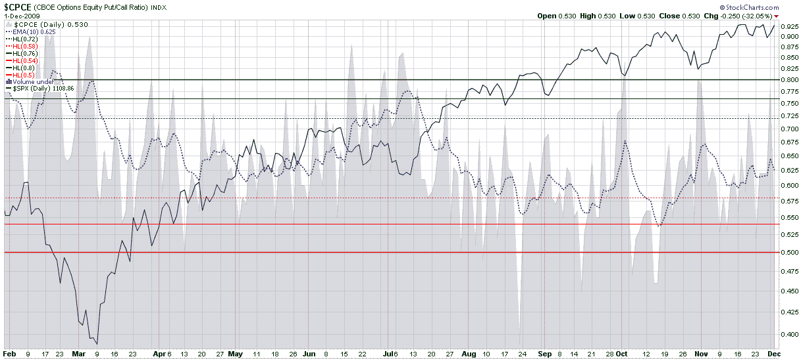

<!--yml
category: 未分类
date: 2024-05-18 17:21:28
-->

# VIX and More: Equity Put to Call Ratio Not Pointing to Correction

> 来源：[http://vixandmore.blogspot.com/2009/12/equity-put-to-call-ratio-not-pointing.html#0001-01-01](http://vixandmore.blogspot.com/2009/12/equity-put-to-call-ratio-not-pointing.html#0001-01-01)

The recent [Dubai](http://vixandmore.blogspot.com/search/label/Dubai) debt crisis has spurred some investors to take some profits, protect their portfolios and contemplate both the acknowledged and hidden threats to the global economy. From Wednesday’s close to Friday’s intraday low, the S&P 500 index (SPX) only fell 17 points or 2.4%, hardly the type of selloff that typically strikes fear into the hearts of bulls. Fearing that further declines may be in the cards, however, investors snapped up puts aggressively, particularly on Monday, when the put buying pushed the CBOE equity [put to call](http://vixandmore.blogspot.com/search/label/put%20to%20call) ratio ([CPCE](http://vixandmore.blogspot.com/search/label/CPCE)) to elevated levels.

In the chart below, I have reproduced the CPCE along with a 10 day exponential moving average (dotted blue line) to smooth the data over a two week period. The chart shows that since the July leg of the current bull market, significant pullbacks in the SPX (solid black line) have been preceded by drops in the 10-day EMA of the CPCE below the 0.58 level. In fact, for the last 5 ½ weeks, the 10-day EMA has never threatened the 0.58 area and at the current 0.625, the CPCE shows no signs of an impending correction.

For related posts on the CPCE, readers are encouraged to check out:

**

***Disclosure:** none*