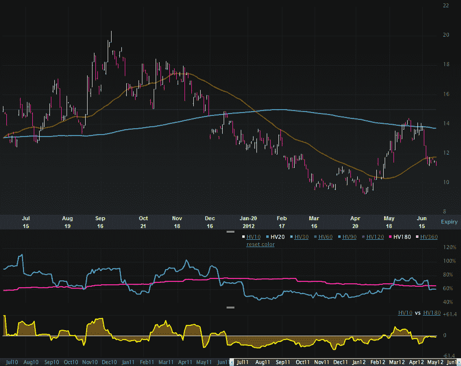

<!--yml
category: 未分类
date: 2024-05-18 16:27:37
-->

# VIX and More: Euro Volatility and Risk

> 来源：[http://vixandmore.blogspot.com/2012/06/euro-volatility-and-risk.html#0001-01-01](http://vixandmore.blogspot.com/2012/06/euro-volatility-and-risk.html#0001-01-01)

With the euro zone summit looming, investors are scrambling to find all sorts of measuring sticks to evaluate the risks of a sharp move in the financial markets. Based on some of the emails I have received, many are skeptical of the VIX right now, which is trading in the mid 19s, some 5% below its lifetime mean. At 27.54, the [VSTOXX](http://vixandmore.blogspot.com/search/label/VSTOXX) (EURO STOXX 50 Volatility Index) is showing much more uncertainty, but even that number is low relative to the range of the VSTOXX for the past three months.

Whether [Spain](http://vixandmore.blogspot.com/search/label/Spain), [Italy](http://vixandmore.blogspot.com/search/label/Italy) or [Greece](http://vixandmore.blogspot.com/search/label/Greece) is the fixation du jour, the questions investors really want answers to ultimately all cluster around the future of the [euro](http://vixandmore.blogspot.com/search/label/euro). I have addressed this question relative to the risk of one or more countries leaving the euro in the context of various [Intrade](http://vixandmore.blogspot.com/search/label/Intrade) contracts (see links below), but another overlooked manner of measuring risk and uncertainty in the euro is the CBOE EuroCurrency Volatility Index ([EVZ](http://vixandmore.blogspot.com/search/label/EVZ)). Sometimes referred to as the “euro VIX,” EVZ uses the VIX methodology to measure the market’s expectations of future volatility in the euro. In theory, therefore, EVZ should also be a proxy for risk and uncertainty in the euro. One might even go as far as to consider EVZ as a euro zone fear indicator.

So what is a chart of EVZ telling us on the eve of another euro zone summit?

The chart below shows that at 11.27, EVZ is currently in the lower portion of its range of 9.23 – 20.34 for the past year. Indeed EVZ is only in the 18^(th) percentile of the range of values over the course of the past year. Also of interest, the current 20-day historical volatility of EVZ (60) is lower than the 180-day historical volatility measure (65) – as has been the case for the majority of the last six months. Last but not least, EVZ has been on a notable downtrend since June 18^(th).

Headlines aside, traders do not see a lot of currency risk in the euro right now, at least relative to the last year or so and as far as the 30-day forward-looking window defined by EVZ is concerned.

So if you think the VIX is depressed and understating market risk, don’t expect the EVZ to be signaling something different. Currency risk and uncertainty seem surprisingly low at current levels. If you think the market has underpriced the potential for a large move in the euro, then consider some long [straddles](http://vixandmore.blogspot.com/search/label/straddle) on the euro or its ETF counterpart, [FXE](http://vixandmore.blogspot.com/search/label/FXE).

Related posts:

**

*[source(s): LivevolPro.com]*

***Disclosure(s):*** *Livevol is an advertiser on VIX and More*