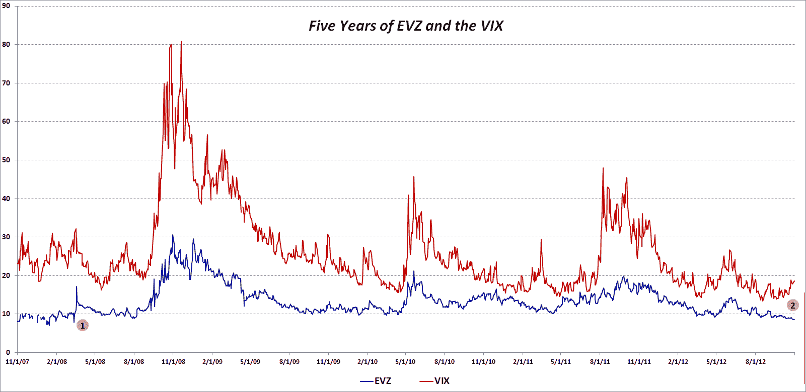

<!--yml
category: 未分类
date: 2024-05-18 16:24:10
-->

# VIX and More: EuroCurrency Volatility Index (EVZ) at Lowest Level Since March 2008, Diverges from VIX

> 来源：[http://vixandmore.blogspot.com/2012/10/eurocurrency-volatility-index-evz-at.html#0001-01-01](http://vixandmore.blogspot.com/2012/10/eurocurrency-volatility-index-evz-at.html#0001-01-01)

Since its launch in August 2008, the CBOE EuroCurrency Volatility Index (ticker [EVZ](http://vixandmore.blogspot.com/search/label/EVZ), sometimes known simply as the “[euro](http://vixandmore.blogspot.com/search/label/euro) VIX”), which is based on the [FXE](http://vixandmore.blogspot.com/search/label/FXE) ETF, has toiled in relative obscurity compared to some of the more famous volatility indices.

Given all the [fears](http://vixandmore.blogspot.com/search/label/fear) about the [European sovereign debt crisis](http://vixandmore.blogspot.com/search/label/European%20sovereign%20debt%20crisis) over the past few years, I find the lack of interest in EVZ to be surprising. After all, in thinking about the euro zone one of the most basic questions has been whether or not the euro will survive.  Further, outside of the U.S. at least, the future of the euro zone is still considered to be the [biggest risk to the stock market](http://vixandmore.blogspot.com/2012/10/us-fiscal-cliff-fears-top-vix-and-more.html).

With all this in mind, I was looking at EVZ data this evening and discovered that today marks five years since the beginning of the historical EVZ data provided by the CBOE (reconstructed data fills the gap from November 2007 to the August 2008 launch.)

The chart below shows the history of closes in EVZ (blue line), as well as comparative closing prices for the VIX (red line.) I have annotated the chart to highlight two pieces of information:

1.  The last time that EVZ closed lower that it did today (8.55) was in March 2008, just before Bear Stearns collapsed and was sold to JP Morgan ([JPM](http://vixandmore.blogspot.com/search/label/JPM))

2.  The recent divergence between a falling EVZ and a rising VIX, which dates from the middle of September, is unusual, particularly given the length of the divergence

So…is EVZ understating the risk to the euro or is the VIX overstating the risk to stocks? Is it possible that these two measures of risk can be moving in opposite directions and both be right?

Related posts:

**

*[source(s): CBOE]*

***Disclosure(s):*** *none*