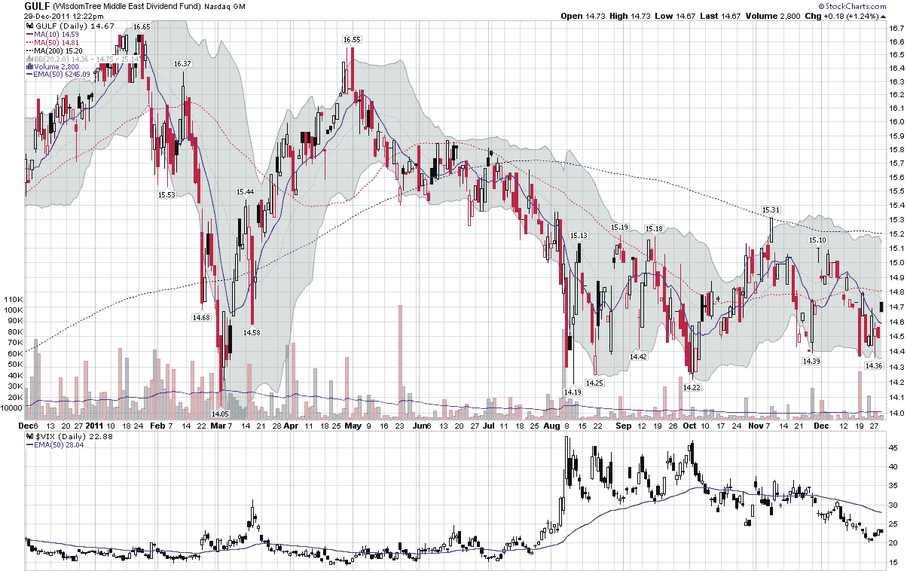

<!--yml
category: 未分类
date: 2024-05-18 16:44:51
-->

# VIX and More: Expectations, Surprises and Fear in 2011

> 来源：[http://vixandmore.blogspot.com/2011/12/expectations-surprises-and-fear-in-2011.html#0001-01-01](http://vixandmore.blogspot.com/2011/12/expectations-surprises-and-fear-in-2011.html#0001-01-01)

For the last three years, the holiday season has been leaving me something new in my stocking: a detailed questionnaire from [Bespoke Investment Group](http://www.bespokeinvest.com/) that provides the raw material for the [annual roundtable](http://bespokepremium.com/roundtable/)…and undoubtedly more than a couple of snickers for Justin, Paul and the gang.

In the inaugural year of the Bespoke roundtable, my crystal ball guesstimates for 2010 proved to be surprisingly accurate, naturally leading me to debate the relative influence of luck vs. skill when I had a chance to reflect back on the events of the year.

When I made my predictions for 2011, I had serious concerns about Europe and [China](http://vixandmore.blogspot.com/search/label/China) in particular, but before January was over, the dawning of the [Arab Spring](http://vixandmore.blogspot.com/search/label/Arab%20Spring) had begun to change the world in a profound and dramatic way, cutting across religious, political and economic dimensions. While the VIX remained in the teens for almost all of January and February, I suspect that when we reflect back on the events of 2011 in another decade or so, the widespread tumult in Northern Africa and the Middle East is likely to produce a more profound long-term effect on the world than any of the other events of the year.

As the Arab Spring continued its geographic spread, a trio of disasters shook Japan, starting with the magnitude 9.0 [Tohoku earthquake and tsunami](http://en.wikipedia.org/wiki/2011_T%C5%8Dhoku_earthquake_and_tsunami), which was followed by a nuclear meltdown at the Fukushima Daiichi nuclear power plant.

So while Europe and China were simmering on the back burner, two huge and unforeseen events reverberated around the world, both of which triggered a large number of downstream consequences.

Events in Europe began heating up in the middle of the year, but they were largely overshadowed by the growing angst over the [U.S. debt ceiling crisis](http://en.wikipedia.org/wiki/United_States_debt-ceiling_crisis) and the political gridlock that seemed poised to prevent a solution to that crisis.  Only after a partial ‘solution’ to the debt ceiling issue was agreed upon and S&P downgraded the credit rating of the U.S. from AAA to AA+ did the [European sovereign debt crisis](http://vixandmore.blogspot.com/search/label/European%20sovereign%20debt%20crisis) return to the center stage, this time roiling the markets throughout the remainder of the year.

In retrospect, being able to anticipate some of the surprises of 2011 would have required expert knowledge of such far-reaching fields as Arab social unrest, plate tectonics, and the inner workings of governments in the U.S., [Greece](http://vixandmore.blogspot.com/search/label/Greece) and elsewhere. On top of all this, it is never easy to discern when a seemingly harmless development will suddenly mushroom out of control into a crisis. Knowledge of this type is much more elusive and requires an understanding of concepts like “[fingers of instability](http://vixandmore.blogspot.com/search/label/fingers%20of%20instability)” which is discussed by Mark Buchanan at length in [Ubiquity: Why Catastrophes Happen](http://www.amazon.com/Ubiquity-Catastrophes-Happen-Mark-Buchanan/dp/0609809989) – and which is a topic I shall pursue in more detail in 2012.

The bottom line is that many of the big risks for 2012 are obvious: Europe, China, Iran, North Korea, etc.

What keeps option sellers up at night and often puts oversized dents in portfolios are those [unknown unknowns](http://en.wikipedia.org/wiki/There_are_known_knowns) lurking just below the surface.

Related posts:

**

[source(s): StockCharts.com]

 ***Disclosure(s):*** *none*