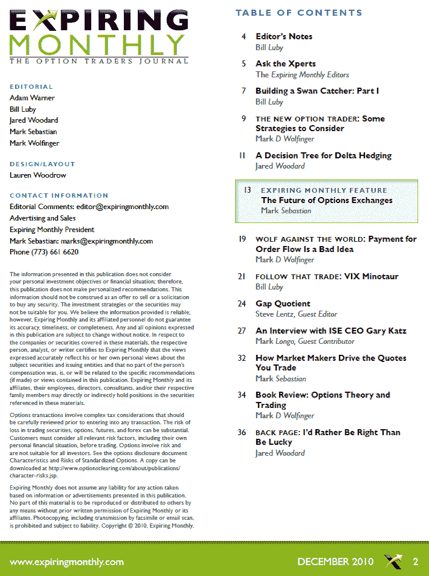

<!--yml
category: 未分类
date: 2024-05-18 16:55:49
-->

# VIX and More: Expiring Monthly December 2010 Issue Recap

> 来源：[http://vixandmore.blogspot.com/2010/12/expiring-monthly-december-2010-issue.html#0001-01-01](http://vixandmore.blogspot.com/2010/12/expiring-monthly-december-2010-issue.html#0001-01-01)

A reminder that the December issue of [*Expiring Monthly: The Option Traders Journal*](http://www.expiringmonthly.com/) was published yesterday and is available for subscribers to [download](http://www.expiringmonthly.com/members/).

This month’s issue has a feature article from Mark Sebastian on the future of options exchanges. On a related subject, Mark Longo interviews Gary Katz, President and CEO of the International Securities Exchange ([ISE](http://vixandmore.blogspot.com/search/label/ISE)).  Additional subjects covered in the magazine include how market makers use volatility to update their quotes, delta hedging, analyzing opening gap tendencies, payment for order flow, directional vs. non-directional strategies, the role of luck and skill in trading, and a review of Ron Ianieri’s recent options book.

I contribute two articles to the December issue. Unintentionally blurring zoomorphism with mythology, one article is based on a trade I call “the Minotaur” while the other has earned the name of “the Swan Catcher.” The Minotaur turns out to be a VIX-[VXX](http://vixandmore.blogspot.com/search/label/VXX) pairs trade and here I embark on a proof-of-concept approach. The Swan Catcher trade also represents something of a bottoms-up approach to developing options strategies. In part one of a two-part series, I seek a way to structure options positions to profit from extreme moves in the market, without losing too much money while one waits for these events to occur.

As is now my habit, I have reproduced a copy of the Table of Contents for the December issue below for those who may be interested in learning more about the magazine. Thanks to all who have already subscribed. For those who are interested in subscription information and additional details about the magazine, you can find all that and more at [http://www.expiringmonthly.com/](http://www.expiringmonthly.com/).

Related posts:

*[source: Expiring Monthly]*

***Disclosure(s):*** *I am one of the founders and owners of Expiring Monthly*