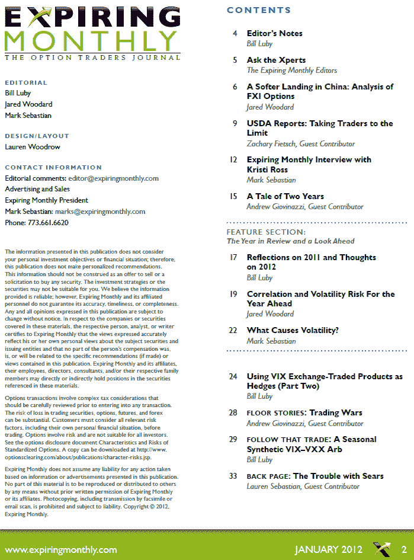

<!--yml
category: 未分类
date: 2024-05-18 16:42:26
-->

# VIX and More: Expiring Monthly January 2012 Issue Recap

> 来源：[http://vixandmore.blogspot.com/2012/01/expiring-monthly-january-2012-issue.html#0001-01-01](http://vixandmore.blogspot.com/2012/01/expiring-monthly-january-2012-issue.html#0001-01-01)

I may have been away on vacation for the last two weeks, but that doesn’t mean my brain was entirely at rest.

In fact I was particularly busy in the January 2012 edition of [*Expiring Monthly: The Option Traders Journal*](http://www.expiringmonthly.com/), which was published last week and is available for subscribers to [download](https://www.expiringmonthly.com/customer/account/login/). As the table of contents below shows, this time around I penned three articles, all with a distinctive VIX flavor:

*   Reflections on 2011 and Thoughts on 2012
*   Using VIX Exchange-Traded Products as Hedges (Part Two)
*   Follow that Trade: A Seasonal Synthetic VIX–VXX Arb

As noted here last week in [The VIX-VXX Minotaur Trade](http://vixandmore.blogspot.com/2012/01/vix-vxx-minotaur-trade.html), the last of those three articles advances some of the thinking I first presented in the December 2010 issue of the magazine.

Since a number of readers have expressed some interest in a listing of all the titles of my articles for *Expiring Monthly*, I intend to post a full list of all those at the end of the week.

Finally, now that I am back on the grid, I can devote some research and analysis to some of the developments that transpired while I was away – so expect regular posting to resume later today.

For those who are interested in subscription information and additional details about the magazine, you can find all that and more at (the newly redesigned) [http://www.expiringmonthly.com/](http://www.expiringmonthly.com/). More information on prior issues (and some of my research interests) can be found by following all the posts tagged herein with the [Expiring Monthly label](http://vixandmore.blogspot.com/search/label/expiring%20monthly).

Related posts:

**

*[source: Expiring Monthly]*

***Disclosure(s):*** *short VXX at time of writing; I am one of the founders and owners of Expiring Monthly*