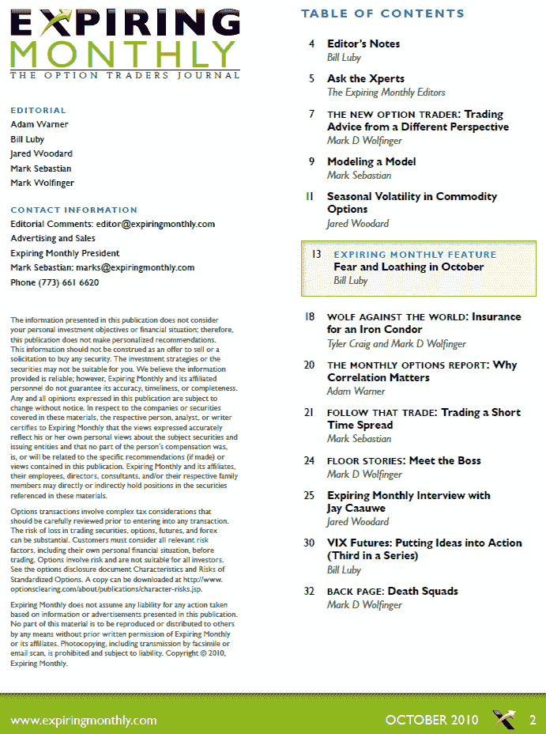

<!--yml
category: 未分类
date: 2024-05-18 17:00:54
-->

# VIX and More: Expiring Monthly October 2010 Issue Recap

> 来源：[http://vixandmore.blogspot.com/2010/10/expiring-monthly-october-2010-issue.html#0001-01-01](http://vixandmore.blogspot.com/2010/10/expiring-monthly-october-2010-issue.html#0001-01-01)

Just a quick reminder that the October issue of [*Expiring Monthly: The Option Traders Journal*](http://www.expiringmonthly.com/) was published today and is available for subscribers to [download](http://www.expiringmonthly.com/members/).

This month I authored two pieces that I think readers might find particularly interesting. The first is the monthly feature, *Fear and Loathing in October*, which examines seasonality from an anecdotal, statistical and a [behavioral finance](http://vixandmore.blogspot.com/search/label/behavioral%20finance) perspective and puts the September through January period under the analytical microscope. Also of interest is the third and final installment in my series on the [VIX futures](http://vixandmore.blogspot.com/search/label/VIX%20futures) [term structure](http://vixandmore.blogspot.com/search/label/term%20structure). *VIX Futures: Putting Ideas into Action* takes a six-part framework for analyzing VIX futures and discusses some of the implications for trading [VIX options](http://vixandmore.blogspot.com/search/label/VIX%20options) and [VIX ETNs](http://vixandmore.blogspot.com/search/label/VIX%20ETN) such as [VXX](http://vixandmore.blogspot.com/search/label/VXX).

I have reproduced a copy of the Table of Contents for the October issue below for those who may be interested in learning more about the magazine. Subscription information and additional details about the magazine are available at [http://www.expiringmonthly.com/](http://www.expiringmonthly.com/).

Related posts:

*[source: Expiring Monthly]*

***Disclosure(s):*** *I am one of the founders and owners of Expiring Monthly*