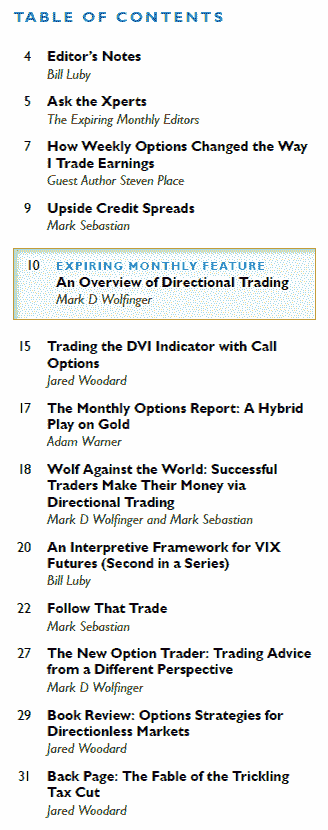

<!--yml
category: 未分类
date: 2024-05-18 17:03:14
-->

# VIX and More: Expiring Monthly September 2010 Issue Recap

> 来源：[http://vixandmore.blogspot.com/2010/09/expiring-monthly-september-2010-issue.html#0001-01-01](http://vixandmore.blogspot.com/2010/09/expiring-monthly-september-2010-issue.html#0001-01-01)

Just a quick reminder that a new options expiration cycle means a new issue of [*Expiring Monthly: The Option Traders Journal*](http://www.expiringmonthly.com/) is available. In fact the September issue was published today and is available for subscribers to [download](http://www.expiringmonthly.com/members/).

The September edition features a handful of articles on the subject of directional trading with options, including a feature article from [Mark Wolfinger](http://blog.mdwoptions.com/options_for_rookies/) and a guest article from Steven Place of [Investing with Options](http://www.investingwithoptions.com/).

In addition to my regular gig as authoring Editor’s Notes, this month I have also contributed the second in a three-part series on the [VIX futures](http://vixandmore.blogspot.com/search/label/VIX%20futures) [term structure](http://vixandmore.blogspot.com/search/label/term%20structure). The current installment lays out a six-part framework for analyzing VIX futures which establishes a foundation for next month’s finale, in which I discuss some of the implications for various VIX term structure patterns as they apply to trading [VIX options](http://vixandmore.blogspot.com/search/label/VIX%20options) and [VIX ETNs](http://vixandmore.blogspot.com/search/label/VIX%20ETN) such as [VXX](http://vixandmore.blogspot.com/search/label/VXX).

 I have reproduced a copy of the Table of Contents for the September issue to the right for those who may be interested in learning more about the magazine. Subscription information and additional details about the magazine are available at [http://www.expiringmonthly.com/](http://www.expiringmonthly.com/).

Related posts:

*[source: Expiring Monthly]*

***Disclosure(s):*** *I am one of the founders and owners of Expiring Monthly*