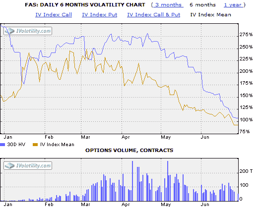
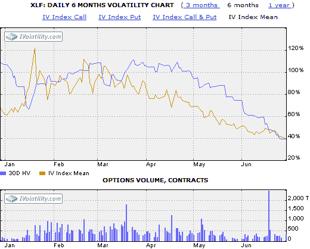

<!--yml
category: 未分类
date: 2024-05-18 17:40:41
-->

# VIX and More: FAS Is Now XLF

> 来源：[http://vixandmore.blogspot.com/2009/06/fas-is-now-xlf.html#0001-01-01](http://vixandmore.blogspot.com/2009/06/fas-is-now-xlf.html#0001-01-01)

For someone who gets a kick out of volatility, the arrival of [triple ETFs](http://vixandmore.blogspot.com/search/label/triple%20ETFs) has been a little bit like manna from heaven. Of course the launch of the [Direxion](http://vixandmore.blogspot.com/search/label/Direxion) triple ETFs back in early November just happened to coincide with the highest VIX readings in history. There is nothing like record volatility, except perhaps record volatility times three.

But a lot has changed since November. The VIX traded in the 80s the month it was launched; today it was as low as 25.02\. At the moment the VIX is exactly 1/3 as high as it was when it peaked in November at 81.38\. For those who have been selling options, the ride down the volatility slide has been an unusually profitable one. In fact, it is likely that some of the premiums harvested in the last nine months or so will turn out to be the most bloated we will see in our trading lifetimes.

My personal interest in the triple ETFs notwithstanding, these vehicles have received mixed reviews, largely because their suitability as buy and hold investments degrades rapidly after just one trading session – with the problems exacerbated by increases in volatility. On the flip side, the recent decrease in volatility has muted some of the tracking and compounding errors inherent in leveraged ETFs. In fact, in the current environment, the 3x and -3x ETFs are starting to look somewhat tame relative to their history. The two charts below show the (30 day) [historical volatility](http://vixandmore.blogspot.com/search/label/historical%20volatility) (purple line) and [implied volatility](http://vixandmore.blogspot.com/search/label/implied%20volatility) (gold line) of the most popular financial sector ETF, [XLF](http://vixandmore.blogspot.com/search/label/XLF), and the 3x financial sector ETF that has taken the trading world by storm, [FAS](http://vixandmore.blogspot.com/search/label/FAS). While there are a number of interesting conclusions to be drawn from these charts, the point I wish to make is that current historical and implied volatility for FAS (top chart) is hovering around the 100 mark, which is about where HV and IV were for XLF (bottom chart) in February, March and April. In other words, the 3x ETF FAS is no more volatile or has more uncertainty in its stock price now than XLF did during the period from October through April. Tracking error aside, FAS is now effectively the ghost of XLF.

*[source: iVolatility]*