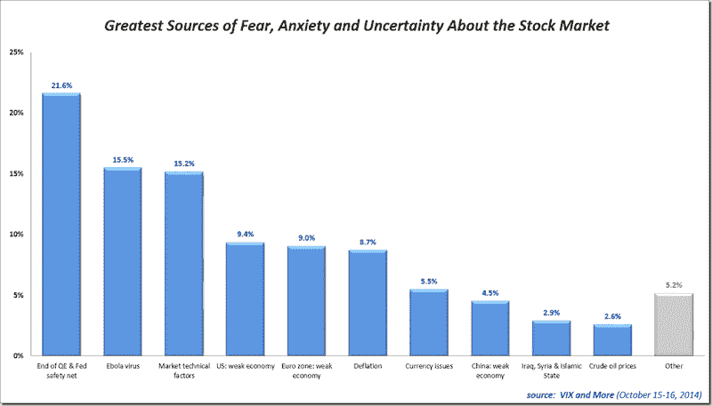

<!--yml
category: 未分类
date: 2024-05-18 16:10:06
-->

# VIX and More: Fear Poll: Fed/QE, Ebola and Technicals Top Worry List

> 来源：[http://vixandmore.blogspot.com/2014/10/fear-poll-fedqe-ebola-and-technicals.html#0001-01-01](http://vixandmore.blogspot.com/2014/10/fear-poll-fedqe-ebola-and-technicals.html#0001-01-01)

Stocks may be in the process of putting in a bottom, but with the VIX hitting 31.06 yesterday at the same time [VIX futures](http://vixandmore.blogspot.com/search/label/VIX%20futures) were setting [new volume records](http://ir.cboe.com/~/media/Files/C/CBOE-Holdings-IR/press-release/2014/cboe-holdings-10-15-14-daily-volume-records.pdf), investor fear and anxiety is as high as it has been since the 2011 [European sovereign debt crisis](http://vixandmore.blogspot.com/search/label/European%20sovereign%20debt%20crisis).

As the [VIX and More Fear Poll](http://vixandmore.blogspot.com/search/label/Fear%20poll) results reflect, the current situation is particularly difficult for investors to grapple with because there is so much disagreement about what the biggest worry is and how some of these fears may be connected.

In the chart below, I have summarized the almost 400 votes from some 35 countries, with the U.S. accounting for 65% of all respondents.

It is worth noting that the responses appear to be somewhat headline driven, as yesterday [Ebola](http://vixandmore.blogspot.com/search/label/Ebola) topped the list of worries, only to be supplanted by concerns about the impact of the Fed ending quantitative easing and in so doing removing the safety net that has helped keep liquidity high, volatility low and investors more confident. I also find it particularly interesting that “market technical factors (breach of support, end of trend, weak internals, etc.)” are so important to a broad range of investors, which raises the question of whether technicals are more of a cause or effect in the recent downturn.

Looking at global economic weakness, slightly more investors expressed concern about the U.S. economy than that of the euro zone, with concerns about the Chinese economy a distant third.

In these types of polls, I am always interested to see how U.S. respondents differ from those outside of the U.S. In the current market environment, U.S. respondents tend to place more emphasis on the weak U.S. economy and the Ebola virus, while paying less attention to currency issues and [China](http://vixandmore.blogspot.com/search/label/China). Some of the detailed results certainly have a whiff of provincialism, yet it remains to be seen whether the global or Americentric perspective does a better job of honing in on what to focus on – a subject I will delve into at a later date.

For those who might be interested in the results of prior VIX and More Fear Poll data, the links below should be a helpful reference.

Last but not least, many thanks to everyone who participated in this poll, which I intend to periodically reprise as market conditions warrant.

*[source(s): VIX and More]*

Related posts:

***Disclosure(s):*** *none*