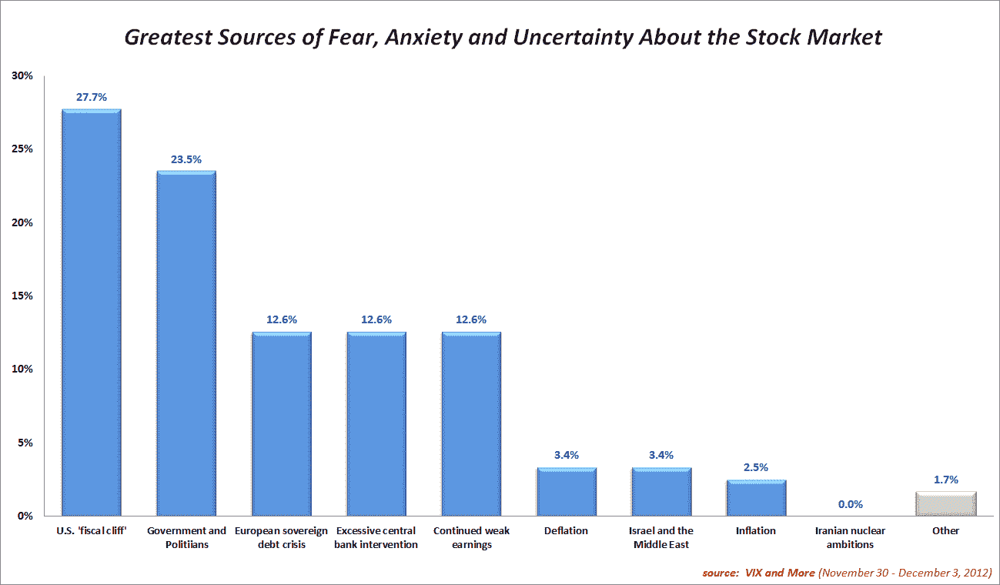
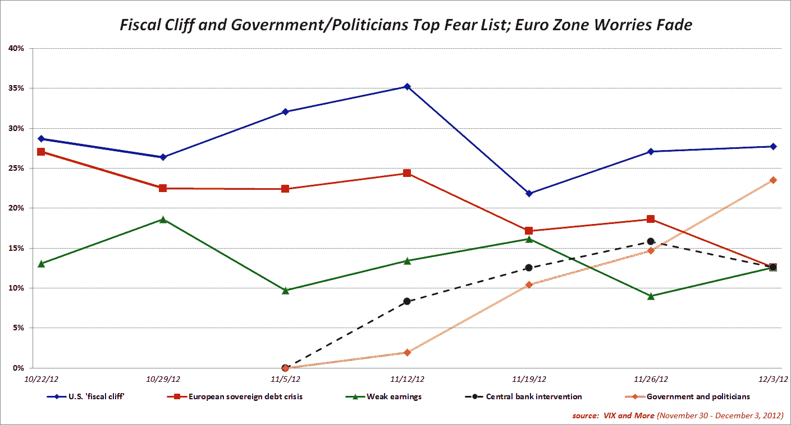

<!--yml
category: 未分类
date: 2024-05-18 16:21:49
-->

# VIX and More: Fear of Governments and Politicians Climb Rapidly as Euro Zone Worries Wane

> 来源：[http://vixandmore.blogspot.com/2012/12/fear-of-governments-and-politicians.html#0001-01-01](http://vixandmore.blogspot.com/2012/12/fear-of-governments-and-politicians.html#0001-01-01)

While concerns about the U.S. [fiscal cliff](http://vixandmore.blogspot.com/search/label/fiscal%20cliff) topped the *VIX and More* weekly [fear poll](http://vixandmore.blogspot.com/search/label/Fear%20poll) for the seventh week in a row, the big story is that investors are increasingly more concerned about the governments and politicians who are tasked with finding the solutions to these crises than the crises themselves.

Even though it is a global concern, [fears](http://vixandmore.blogspot.com/search/label/fear) and anxieties related to governments and politicians is most evident in the United States, where governments and politicians outpolled the fiscal cliff by a margin of 27.9% to 26.7%. Frustrations over the actions (or lack thereof) of governments and politicians were only the #4 concern outside of the U.S., where the fiscal cliff polled in the #1 slot, followed by the [European sovereign debt crisis](http://vixandmore.blogspot.com/search/label/European%20sovereign%20debt%20crisis) and continued weak earnings.

Respondents across the globe now see enough progress in the euro zone that the financial crisis in Europe has been relegated to a second tier of worries.

Another development worth noting is the sudden disappearance of an Americentric bias in the fiscal cliff issue. Over the past six weeks U.S. based respondents have been 13.1% more likely than non-U.S. respondents to cite the fiscal cliff as their top concern. This week was the first week that non-U.S. respondents saw the fiscal cliff as a bigger fear than their U.S. counterparts. Of course if one were to attribute most of the anxiety over governments and politicians in the U.S. to the fiscal cliff, then the results of this poll might say more about how different populations see the root cause of the fiscal cliff issue than anything else.

As noted last week, if one adds up the fiscal cliff, euro zone, central bank and government + politicians responses, it is possible to pin some 75-80% of all investor fears on institutions such as central banks and governments, with the fiscal cliff and the euro zone financial crisis merely symptoms of a larger underlying problem.

Once again, thanks to all who participated in this weekly poll.

Related posts:

***Disclosure(s):*** *none*