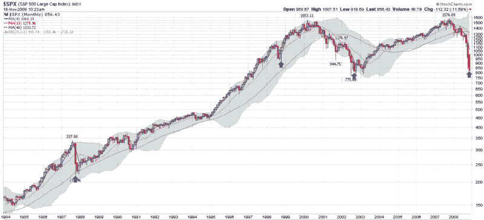

<!--yml
category: 未分类
date: 2024-05-18 18:15:49
-->

# VIX and More: Fifty Day Historical Volatility Rolling Over?

> 来源：[http://vixandmore.blogspot.com/2008/11/fifty-day-historical-volatility-rolling.html#0001-01-01](http://vixandmore.blogspot.com/2008/11/fifty-day-historical-volatility-rolling.html#0001-01-01)

Something interesting happened yesterday that has happened very rarely over the past two months or so: 50 day [historical volatility](http://vixandmore.blogspot.com/search/label/historical%20volatility) (HV) in the S&P 500 index dropped. While that fact in itself might not be worth of a headline next to the latest installment of ‘Adventures in TARPland,’ there is a strong possibility that historical volatility in the SPX has just peaked.

Actually the 10 day version of historical volatility for the SPX peaked back on October 22^(nd), followed by the 20 and 30 day HV topping out on November 5^(th) and November 7^(th). It is too early to say definitively that 50 day historical volatility will not exceed Friday’s high, but the odds are in favor of it, as it is only a couple more days before the Lehman-powered selloff of September 15^(th) scrolls off of the 50 day lookback window.

Now I’m sure this bit of volatility trivia is not likely to excite readers, so I have included a chart below which shows the last three times 50 day historical volatility in the SPX has peaked at a level of 30 or higher. While all three previous instances (marked by the blue arrows) have turned out to be excellent buying opportunities, finding historical parallels to help interpret the current market situation has lately been an approach fraught with danger.

A better way to think about historical volatility rolling over is that like the VIX, historical volatility is a barometer of some of the uncertainty and emotional components of the markets. As these readings begin to pull back from recent highs, investors of all persuasions are more likely to enter the markets.

[source: StockCharts]