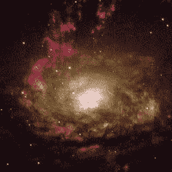

<!--yml
category: 未分类
date: 2024-05-18 15:49:08
-->

# VIX and More: First Annual VIX and More Blog Disclaimer Awards

> 来源：[http://vixandmore.blogspot.com/2007/04/first-annual-vix-and-more-blog.html#0001-01-01](http://vixandmore.blogspot.com/2007/04/first-annual-vix-and-more-blog.html#0001-01-01)

After the [events of yesterday](http://vixandmore.blogspot.com/2007/04/on-risk-real-money-and-cnbc-million.html), I decided to add a disclaimer to the blog.  I consider it some sort of small victory that I was relatively comfortable being disclaimer free for three months, but after a brief meeting with legal (my wife), I decided to state formally what should be acutely obvious to everyone who reads anything on these pages.

So I got to wondering how other bloggers have tackled this issue.  It turns out that most have a disclaimer whose content seems to be a function of the legal status of the entity they write for, professional licenses held, number of months as a blogger, etc.  No real surprises here.  Some appear to take a fine toothed legal comb approach to the disclaimer while others appear to try to cover the bases with a broad brush stroke.

After looking at all 32 bloggers on my “Blogs I Read” list and another 100 or so whose [feeds I subscribe to](http://vixandmore.blogspot.com/2007/04/bloglines-and-information-waterworks.html) (if you have not yet tried [Bloglines](http://www.bloglines.com/), you are really doing yourself a disservice), I am hereby announcing the winners in the *First Annual VIX and More Blog Disclaimer Awards*:

***First Place***– David Merkel at [The Aleph Blog](http://alephblog.com/) (scroll to the bottom for the disclaimer, but make sure you eventually review the even better content above it) covers all the bases succinctly, with some appropriately self-effacing prose

***Second Place*** – [Bill Rempel a.k.a. NO Doodahs!](http://www.billakanodoodahs.com/my-disclaimer/), for striking the right balance between the necessary cautions and a candid yet humorous non-legalese tone

***Third Place***– Ron Sen at [Technically Speaking, Market Analysis and Theory](http://ronsen.blogspot.com/), for his pithy and pointed “*Educational use only.  Never intended as advice.*” tagline he appends to each post.  Make sure to catch Ron’s consistently excellent charts and analysis, including fairly frequent commentary on the VIX.

*Honorable Mention* – [uglychart.com](http://www.uglychart.com/?page_id=1535) – for someone who excels at presenting the lighter side of investing, uglychart is all over the legal disclaimer like a first year [associate](http://greedyassociates.com/).  Other sites may edge him out in the word count department, but uglychart still prevails on style points.  (I have no idea why uglychart is suddenly ending up on all my lists.  I’ve  never even had any contact with the guy…)

Winners are entitled to download the JPG of the [black hole in the Circinus Galaxy](http://apod.nasa.gov/apod/ap001204.html) above and are encouraged to do whatever they can to capitalize on any notoriety and/or commercial opportunities this award may make available to them.