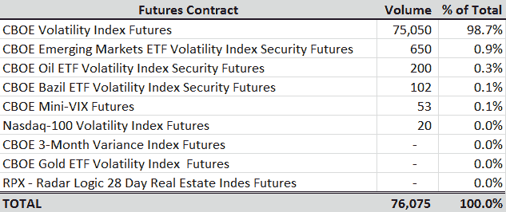

<!--yml
category: 未分类
date: 2024-05-18 16:29:50
-->

# VIX and More: First Day of Trading in Nasdaq-100 Volatility Index (VXN) Futures

> 来源：[http://vixandmore.blogspot.com/2012/05/first-day-of-trading-in-nasdaq-100.html#0001-01-01](http://vixandmore.blogspot.com/2012/05/first-day-of-trading-in-nasdaq-100.html#0001-01-01)

You really need a scorecard to keep up with the new product launches at the CBOE. Today was potentially a big one, with the launch of futures on the Nasdaq-100 Volatility Index, which most of us simply refer to as [VXN](http://vixandmore.blogspot.com/search/label/VXN) or Vixen.

 *As the table below shows, the VIX continues to account for approximately 99% of the volatility index futures at the CBOE Futures Exchange ([CFE](http://vixandmore.blogspot.com/search/label/CFE)). Today VXN futures ([VN](http://vixandmore.blogspot.com/search/label/VN)) traded 20 contracts on its opening day. While futures in the CBOE Emerging Markets ETF Volatility Index ([VXEEM](http://vixandmore.blogspot.com/search/label/VXEEM)) are currently positioned at the #2 product at the CFE, VXN futures certainly have a lot of potential, with the likes of Apple ([AAPL](http://vixandmore.blogspot.com/search/label/AAPL)), Facebook ([FB](http://vixandmore.blogspot.com/search/label/FB)) and Google ([GOOG](http://vixandmore.blogspot.com/search/label/GOOG)) and other technology high fliers folded into this security.

On a related note, for anyone who may be interested, I authored the feature article, The Expanding Volatility Megaplex, in the current edition of [Expiring Monthly](http://www.expiringmonthly.com/). This article chronicles the history of volatility indices and looks at how the CBOE has recently begun to aggressively expand the scope of volatility indices and turn these into product platforms for futures, options and exchanged-traded products.

Related posts:

**

*[source(s): CBOE Futures Exchange]*

***Disclosure(s):*** *The CBOE is an advertiser on VIX and More**