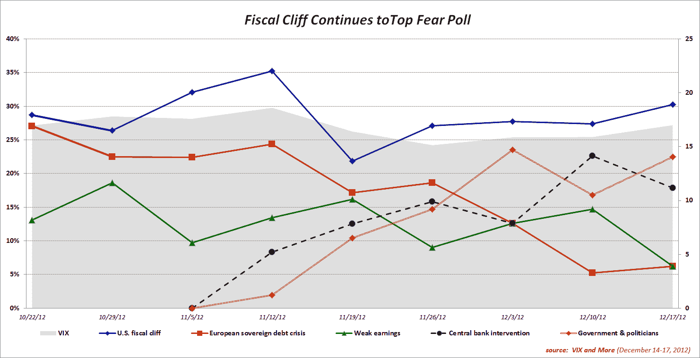
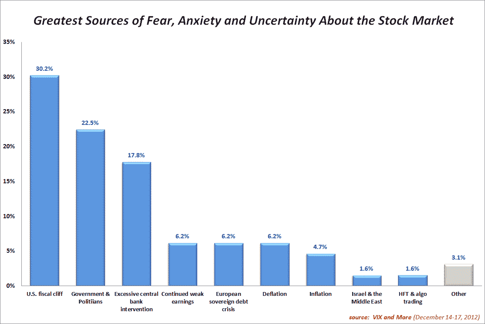

<!--yml
category: 未分类
date: 2024-05-18 16:21:03
-->

# VIX and More: Fiscal Cliff Continues to Top Fear Poll

> 来源：[http://vixandmore.blogspot.com/2012/12/fiscal-cliff-continues-to-top-fear-poll.html#0001-01-01](http://vixandmore.blogspot.com/2012/12/fiscal-cliff-continues-to-top-fear-poll.html#0001-01-01)

In a week in which there appears to have been little progress in the U.S. [fiscal cliff](http://vixandmore.blogspot.com/search/label/fiscal%20cliff) negotiations, investors continue to cite the fiscal cliff as the largest threat to the stock market in the *VIX and More* weekly [fear poll](http://vixandmore.blogspot.com/search/label/Fear%20poll). [Fears](http://vixandmore.blogspot.com/search/label/fear) related to government and politicians beat out concerns about excessive central bank intervention as the #2 issue, while anxiety related to the [European sovereign debt crisis](http://vixandmore.blogspot.com/search/label/European%20sovereign%20debt%20crisis) finished in a tie for fourth.

The poll marked only the third time in nine weeks that U.S. and non-U.S. respondents agreed on the top threat and was the first time that U.S. and non-U.S. respondents placed the top two threats in the same order. In fact, agreement on the order of the threats was the same through the top three.

In another sign that geographical proximity bias has receded, U.S. respondents gave more weight to the European sovereign debt crisis than non-U.S. respondents (the majority of whom are European), while non-U.S. respondents gave more weight to the fiscal cliff than U.S. respondents. In previous weeks, there had been strong evidence of regional myopia.

Another item of note, with last week’s dramatic change in Fed policy away from a timetable to targeted unemployment and inflation rates, one might expect the balance of fear to tilt more in the direction of inflation or deflation this week. Instead, there was a notable jump in concerns over both inflation and deflation, particularly from U.S. respondents.

It is reasonable to ask what might happen if there is a deal in the fiscal cliff in the next week or two. Will a deal also have a significant impact on concerns related to government and politicians or will concerns related to institutions persist and prove to be something more than an event-specific concern? Finally, if the fiscal cliff fears disappear with a deal, which new fears will bubble up to take its place? This week several respondents submitted write-in votes related to [high-frequency trading](http://vixandmore.blogspot.com/search/label/high%20frequency%20trading) (HFT) and algorithmic trading. Will this be the next fear to stalk the stock market?

Once again, thanks to all who participated in this weekly poll.

Related posts:

***Disclosure(s):*** *none*