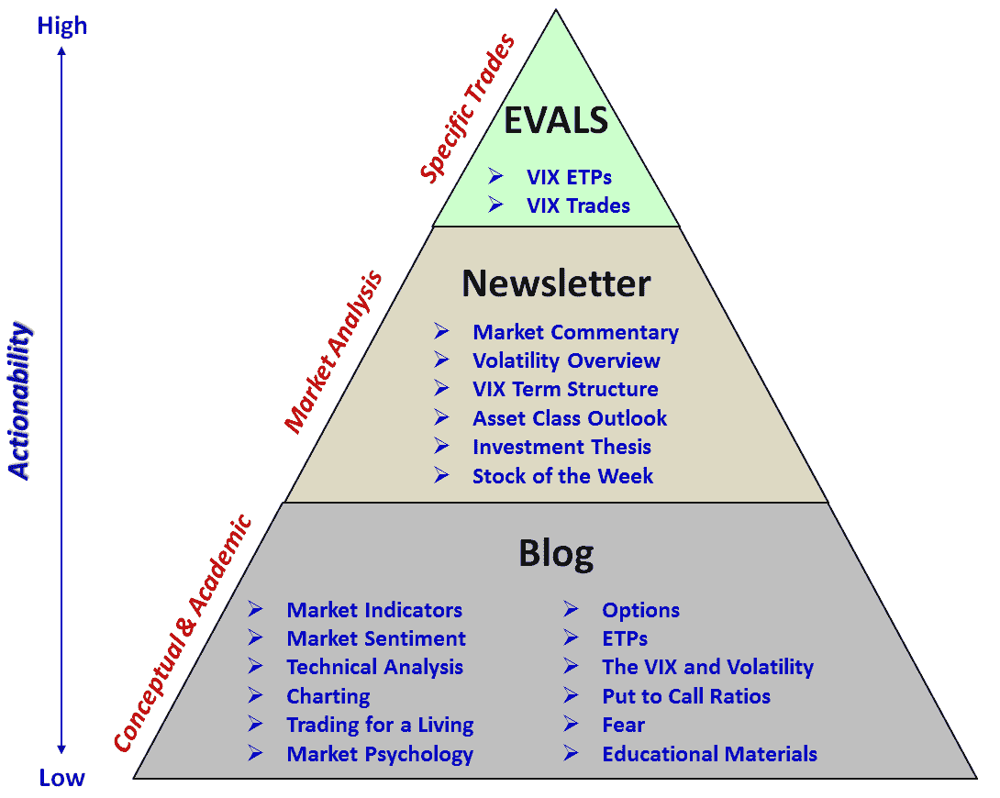

<!--yml
category: 未分类
date: 2024-05-18 16:43:20
-->

# VIX and More: Five Years of VIX and More

> 来源：[http://vixandmore.blogspot.com/2012/01/five-years-of-vix-and-more.html#0001-01-01](http://vixandmore.blogspot.com/2012/01/five-years-of-vix-and-more.html#0001-01-01)

One week ago marked five years since my first post at *VIX and More*. Since this anniversary fell just after my [Top Posts of 2011](http://vixandmore.blogspot.com/2011/12/top-posts-of-2011.html) entry, it seemed like another retrospective look at the blog might be one too many. After a week of reflection I am now convinced that [The 1000^(th) Post](http://vixandmore.blogspot.com/2009/06/1000th-post.html) is probably best left unchallenged (for now at least) as my definitive history of the ideas represented on this blog and a good reference for relatively new readers. Another link worth highlighting is the hopefully self-explanatory [The Post of the Month: An Informal History of VIX and More](http://vixandmore.blogspot.com/2009/10/post-of-month-informal-history-of-vix.html). Last but not least, for those interested in the best of the archives, those few posts with the [hall of fame](http://vixandmore.blogspot.com/search/label/hall%20of%20fame) label are among my personal favorites.

In order to mark the five-year anniversary, I have elected to highlight the ten most-read posts on the blog since its inception, with some commentary about each post.

1.  [Ten Things Everyone Should Know About the VIX](http://vixandmore.blogspot.com/2008/04/ten-things-everyone-should-know-about.html) – If there is one post on this blog that everyone could benefit from – and new readers might wish to start with – this is the one. I last updated the contents of this post in 2010 and I will be sure to revise it again in the near future.

2.  [How to Trade the VIX](http://vixandmore.blogspot.com/2009/08/how-to-trade-vix.html) – This is a fairly basic explanation about how to trade the VIX that probably benefits from having a title that positions it well for Google searches. There are a number of related posts about how to trade the VIX (some of which are links in the original), but here is a case where I should also have an updated look at the subject, with some more comprehensive information.

3.  [VXX Calculations, VIX Futures and Time Decay](http://vixandmore.blogspot.com/2009/05/vxx-calculations-vix-futures-and-time.html) – I find it interesting that a post which was unable to crack the top ten in the year it was written (2009) is now in the top three of all time. I believe this was the first explanation anywhere went into the details of the [VIX futures](http://vixandmore.blogspot.com/search/label/VIX%20futures) [roll yield](http://vixandmore.blogspot.com/search/label/roll%20yield) and the math involved persistent [contango](http://vixandmore.blogspot.com/search/label/contango) and the resulting price decay in [VXX](http://vixandmore.blogspot.com/search/label/VXX). As so many traders have taken up the cause in trading VXX and related products, this post has become an invaluable educational resource and is frequently linked to almost three years later.

4.  [Why VXX Is Not a Good Short-Term or Long-Term Play](http://vixandmore.blogspot.com/2009/10/why-vxx-is-not-good-short-term-or-long.html) – Written several months after the post above, this extended some of the ideas that I had fleshed out earlier in a manner that investors have found helpful regardless of the time frame in which they are trading.

5.  [Prediction: Direxion Triple ETFs Will Revolutionize Day Trading](http://vixandmore.blogspot.com/2008/11/prediction-direxion-triple-etfs-will.html) – One thing I tried to do when I started this blog was to focus on educational material instead about talking about my trades or what I was expecting from the markets. Every once in a while, however, there were some things that I saw as very likely to happen that cut against traditional thinking. This triple ETF call was one of those and also helped to attract attention to these new products.

6.  [Chart of the Week: Might Recent Volume Bottom Doom Stocks?](http://vixandmore.blogspot.com/2009/06/chart-of-week-might-recent-volume.html) – I was surprised to see this post on the last as the analysis is probably not among my best thinking. What I believed happened was that at the time this was written, investors had become concerned that stocks had rallied too sharply off of their March 2009 lows and were likely to run out of steam soon. As it turns out, stock sold off for about two weeks after this post, falling back to SPX 869, then resumed their bullish momentum.

7.  [What Is High Implied Volatility?](http://vixandmore.blogspot.com/2008/04/what-is-high-implied-volatility.html) – This post from 2008 helped to explain several different ways of evaluating [implied volatility](http://vixandmore.blogspot.com/search/label/implied%20volatility) relative to various benchmarks, at a time when investors were becoming increasingly concerned about volatility. Questions about implied volatility continue to be big issues for new options traders.

8.  [SPX 15% Over 200 Day Moving Average for First Time in Ten Years](http://vixandmore.blogspot.com/2009/08/spx-15-over-200-day-moving-average-for.html) – While I will probably never get a job writing headlines for the New York Post, every once in a while my research and analysis uncovers something that has widespread appeal and a catchy enough headline to attract a lot of attention. While this headline and the accompanying graphic sound ominous, stocks shook off the bearish warning and continued to rally.

9.  [Rule of 16 and VIX of 40](http://vixandmore.blogspot.com/2010/05/rule-of-16-and-vix-of-40.html) – When people try to explain to me why they like the blog, what usually comes out is some sort of variation of, “You make very technical material easy to understand.” This post is probably one of the better examples of this. Many people struggle with some of the math associated with the VIX and having read this, I know the lights have gone for a number of investors.

10.  [Lost in Translation: VXX and VXZ](http://vixandmore.blogspot.com/2009/04/lost-in-translation-vxx-and-vxz.html) – This post preceded #3 and #4 on this list and  was probably the first piece published anywhere that talked about the beta of VIX, VXX and [VXZ](http://vixandmore.blogspot.com/search/label/VXZ) relative to SPX. Most investors had not figured out what to expect with VXX and VXZ in terms of VIX moves back in April 2009 – and quite a few still struggle with this issue to this day.

Finally, one recent development worth noting is the re-launch of [EVALS](http://vixandmoreevals.blogspot.com/) (**E**TP **V**olatility **A**nalysis **L**ong-**S**hort) in November. EVALS is now focusing on VIX-based ETPs and this has created some confusion from readers about what content is on the blog, what is in the newsletter and what is in EVALS. For this reason, I have created a content pyramid below which should help to differentiate between what can be found where. Of course the blog is free to all, while the [newsletter](http://vixandmoresubscriber.blogspot.com/) and EVALS are available only to subscribers.

Related posts:

******

 ***Disclosure(s):*** *short VXX at time of writing*