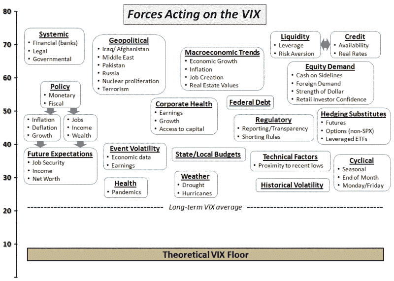

<!--yml
category: 未分类
date: 2024-05-18 17:37:00
-->

# VIX and More: Forces Acting on the VIX

> 来源：[http://vixandmore.blogspot.com/2009/07/forces-acting-on-vix.html#0001-01-01](http://vixandmore.blogspot.com/2009/07/forces-acting-on-vix.html#0001-01-01)

I have received quite a few requests to comment on the recent falling VIX, which stands at 23.23 as I write this, as well as the [VIX:VXV ratio](http://vixandmore.blogspot.com/search/label/VIX%3AVXV), how far I expect the current bull leg to run, etc.

I will get to most of this over the weekend (and [newsletter subscribers](http://vixandmoresubscriber.blogspot.com/) will invariably get a much more detailed sense of my thinking), but I thought this might be a good time to put up a graphic that attempts to capture some of the many forces that act on the VIX. Going forward, I believe having a framework to refer to when talking about the VIX might help ground some of the dialogue.

When all is said and done, the VIX reflects supply and demand for options on the S&P 500 index. The factors that affect movements in the VIX from day to day or week to week, however, are always in flux. The graphic below is the result of a brain dump I did this morning in an effort to put some of these factors onto a single page. I started in on grouping the forces that act on the VIX and using some arrows to indicate relationships between the various factors, etc., but this clearly requires a little more soak time before it will look like a finished product. For that reason, I thought I might post this graphic here and ask for reader feedback.

*[Note that the relative positions of the shapes on the VIX axis are not necessarily indicative of the potential effect they might have on the VIX. At first I wanted the graphic to encapsulate each factor on a relative importance scale and yet also have grouping and arrows that helped to described the relationships across factors. I think this might have been a little too much wishful thinking in just two dimensions, so the graphic below has some of the relative importance and some of the relationships, but is far from the last word on the subject.]*

