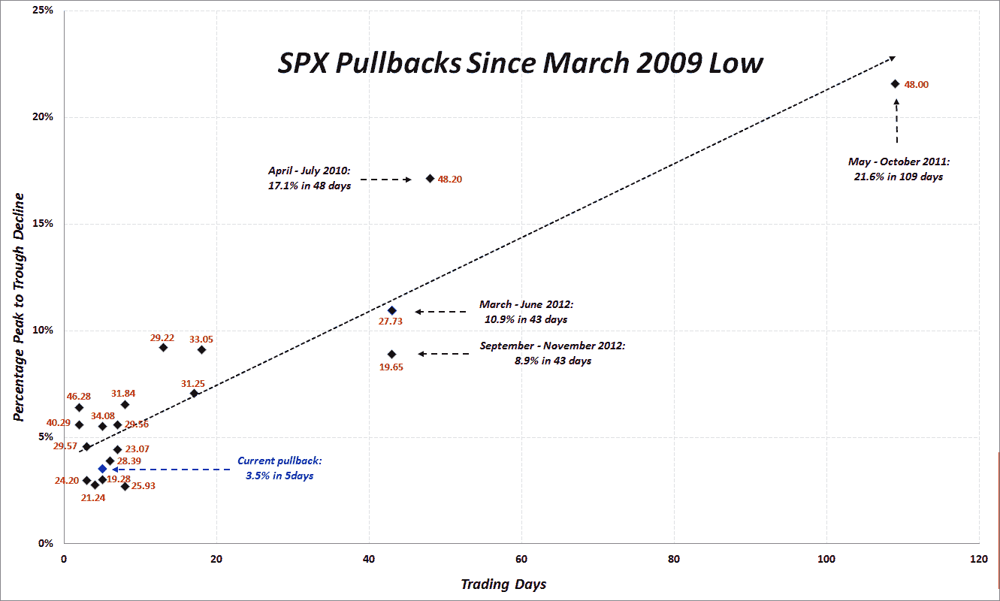

<!--yml
category: 未分类
date: 2024-05-18 16:16:59
-->

# VIX and More: Four Years of SPX Pullbacks in One Plot

> 来源：[http://vixandmore.blogspot.com/2013/04/four-years-of-spx-pullbacks-in-one-plot.html#0001-01-01](http://vixandmore.blogspot.com/2013/04/four-years-of-spx-pullbacks-in-one-plot.html#0001-01-01)

Each time stocks correct, I invariably receive requests from readers to update my SPX pullback summary data, as I did most recently on February 26^(th) in [Updated SPX Pullback Summary Table for SPX 1485](http://vixandmore.blogspot.com/2013/02/updated-spx-pullback-summary-table-for.html), after the S&P 500 Index had pulled back 3.0% from a recent high.

Rather than simply add another row to that table to capture the peak-to-trough decline of 3.5% from Thursday’s high of SPX 1597 and today’s early session low of 1541, I thought it might be more instructive to update an old plot of all twenty pullbacks that I have catalogued since the March 2009 bottom in stocks.

In the plot below, the y-axis captures the magnitude of the peak-to-trough decline (inverted) and the x-axis records the duration of that move. At the risk of making the graphic somewhat of an eye chart, I have also included the peak VIX during the pullback as a red label for each dot. Just for fun, the long dotted black line is a linear fit of all the data points.

I have annotated the data for some of the larger pullbacks and have also highlighted the current pullback in blue text. Some might find it interesting to note that with the VIX has exceeded 19.00 in every pullback with the exception of the 17.90 peak VIX value during the current pullback.

Of course there is no guarantee that the current pullback will stop at 3.5%, but if it does, it will certainly be one of the mildest pullbacks of the 2009-2013 bull market.

*[source(s): CBOE, Yahoo, VIX and More]*

Related posts:

***Disclosure(s):*** *none*