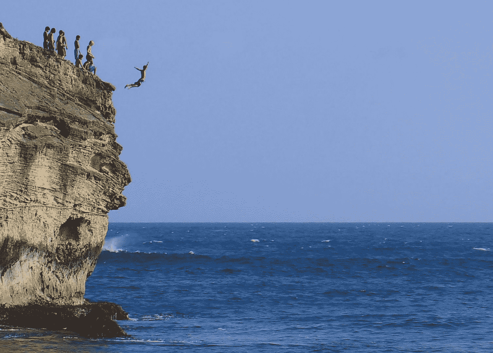

<!--yml
category: 未分类
date: 2024-05-18 16:41:07
-->

# VIX and More: Geography, Focus and Strategy

> 来源：[http://vixandmore.blogspot.com/2012/02/geography-focus-and-strategy.html#0001-01-01](http://vixandmore.blogspot.com/2012/02/geography-focus-and-strategy.html#0001-01-01)

Way back in 2007, in [Bicoastal Trading…Or Are You Trading in the Right Time Zone?](http://vixandmore.blogspot.com/2007/05/bicoastal-tradingor-are-you-trading-in.html) I offered some thoughts on my experience trading on the West Coast versus the East Coast. At the time, I speculated that the Mountain Time Zone might be the best place to have a trading life that was seamlessly interwoven with the rest that life has to offer.

In the intervening years, I have made a few trips to Hawaii and am now convinced that at least for those who are content being an end-of-day trader, Hawaii may indeed be the ideal trading paradise – and certainly one with the most alluring [geography dividend](http://vixandmore.blogspot.com/search/label/geography%20dividend).

Last month, when I was taking some time away (or mostly away) from the markets, it struck me how much geography has influenced what I focus on, what and how I trade, and more broadly what strategies I implement.

When I am on the East Coast, for instance, I place much more emphasis on the European markets and economic data that is released just before or after the opening bell. I am much more likely to trade futures and focus my attention on the many blue chips whose earnings are released before the market opens. I may even break with tradition and turn on CNBC. In short, I have a much greater BMO focus.

By contrast, when I am on the West Coast, I find that I focus more on the Asian markets (checking in before I go to bed), trade a preponderance of West Coast technology stocks that generally report after the markets are closed and also find myself trading in the after-hours session much more often.

In Hawaii, everything is different. The markets close at 11:00 a.m. (10:00 a.m. during daylight savings time) and my routine switches to glancing at the markets, going out for a run, checking to see if the markets are relatively quiet when I return, showering and going for breakfast, then making any position adjustments just prior to the closing bell. All strategies become end of day strategies and short-term trades are much more likely to be multi-day swing trades than day trades.

In a nutshell, my geography determines where (and when) I focus my attention, and that focus has important implications for what I trade, when I trade it and what my anticipated holding period is for each position. Strategy, therefore, becomes a byproduct of geography.

There is nothing like [Hawaii-Aleutian Standard Time](http://en.wikipedia.org/wiki/Hawaii-Aleutian_Time_Zone) to put the world in a different perspective and to serve as a reminder that no matter where you are – either as a visitor or with roots firmly in the ground – it is important to match your strategies and focus to your geography and time zone.

Related posts:

******

*[Future naked options sellers line up for another grueling day of work at Shipwreck Beach, Kauai]*

***Disclosure(s):*** *none*