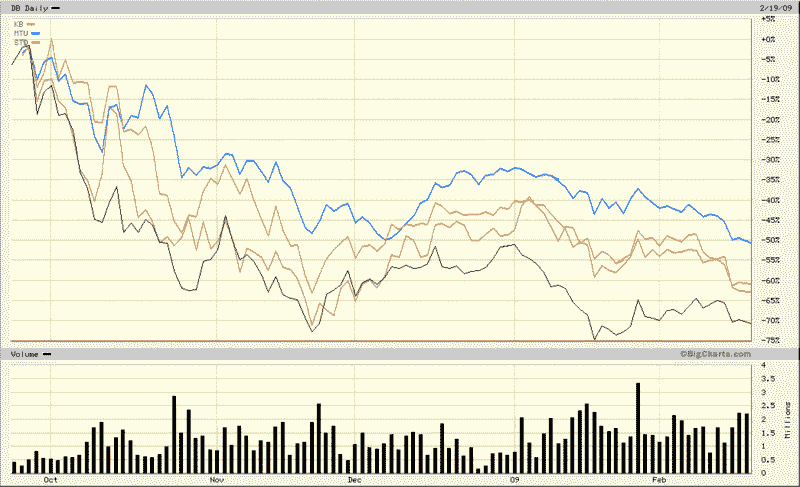

<!--yml
category: 未分类
date: 2024-05-18 17:58:52
-->

# VIX and More: Global Bank Stocks in a Post-Lehman World

> 来源：[http://vixandmore.blogspot.com/2009/02/global-bank-stocks-in-post-lehman-world.html#0001-01-01](http://vixandmore.blogspot.com/2009/02/global-bank-stocks-in-post-lehman-world.html#0001-01-01)

I get tired of talking about the banks, but it is *the* story for the foreseeable future. While Citigroup’s ([C](http://vixandmore.blogspot.com/search/label/C)) common stock flirts with the 2.00 line (can we call it Bank of [Mendoza](http://en.wikipedia.org/wiki/Mendoza_Line)?) and insists it has not had conversations with the government about nationalization, Bank of America ([BAC](http://vixandmore.blogspot.com/search/label/BAC)), whose stock is barely above the 3.00 level, is also out saying, “We see no reason to nationalize a bank that is profitable, well capitalized and actively lending.” Add to the financial stew a Wells Fargo ([WFC](http://vixandmore.blogspot.com/search/label/WFC)) stock under 10.00 for the first time since 1996 and it is hard not to be obsessed by the banking sector.

For all the discussion of U.S. banks, I wish to turn to the global scene. Lately U.K. banks and Irish banks have been the target of rumblings about possible nationalization, so I am going to skip over banks from these countries and instead focus on the largest banks in two critical European countries (Germany and Spain) and two critical Asian countries (Japan and South Korea). These four banks are Deutsche Bank ([DB](http://vixandmore.blogspot.com/search/label/DB)), Banco Santander ([STD](http://vixandmore.blogspot.com/search/label/STD)), Mitsibushi UFJ Financial ([MTU](http://vixandmore.blogspot.com/search/label/MTU)) and Kookmin Bank ([KB](http://vixandmore.blogspot.com/search/label/KB)). All four banks happen to trade in the U.S. via [American Depository Receipts](http://en.wikipedia.org/wiki/American_Depositary_Receipt) (ADRs).

In the chart below, I have graphed the performance of all four giant banks since the last week in September, when the ripple effects of the Lehman bankruptcy and nationalization of AIG began to be felt across the globe. Not surprisingly, all four banks have seen their stock prices fall by more than 50%, with Deutsche Bank the worst performer among the group and Mitsibushi UFJ Financial feeling the least amount of pain. For comparison purposes, most of the Irish and British banks are down more than 90% during the same period.

The global banking crisis obviously has a long way to go before anyone can say with confidence that it is behind us. In the interim, even a medium-sized bank from a country most U.S. investors are not watching closely can lead to another tipping point that puts the global financial system closer to the brink. Investors seeking to keep a weather eye on global financial firms may also wish to monitor closely the iShares Global Financials ETF ([IXG](http://vixandmore.blogspot.com/search/label/IXG)).

*[source: BigCharts]*