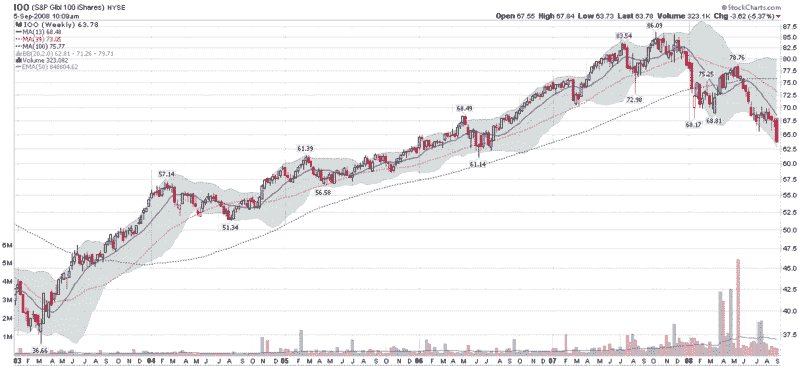

<!--yml
category: 未分类
date: 2024-05-18 18:28:04
-->

# VIX and More: Global Equities Falling Through Support

> 来源：[http://vixandmore.blogspot.com/2008/09/global-equities-falling-through-support.html#0001-01-01](http://vixandmore.blogspot.com/2008/09/global-equities-falling-through-support.html#0001-01-01)

The U.S. markets may look ugly right now, but the global picture is even worse.  Pull up a chart of the South Korean [KOSPI](http://stockcharts.com/charts/gallery.html?%24KOSPI) if you really want to see an ugly market.

For an ETF with global perspective, I am a fan of the [iShares S&P Global 100 Index](http://www2.standardandpoors.com/portal/site/sp/en/us/page.topic/indices_gbl100/2,3,2,1,0,0,0,0,0,2,1,0,0,0,0,0.html) ETF ([IOO](http://finance.google.com/finance?q=ioo)), which is comprised of 100 large cap (average $10 billion) multinational companies that are selected based on the firm’s percentage of foreign assets, revenues, and employees.  For more details, check out the [S&P 100 holdings](http://www2.standardandpoors.com/portal/site/sp/en/us/page.topic/indices_gbl100/2,3,2,1,0,0,0,0,0,2,3,0,0,0,0,0.html).

As the weekly chart of the IOO shows, the deterioration in the global equity picture has accelerated dramatically this week, with stocks falling through technical support and bringing the IOO back to levels not seen since July 2006.  If IOO cannot hold the 2006 support level of 61.00, then another even uglier leg down is certainly a distinct possibility.

 [source: StockCharts]