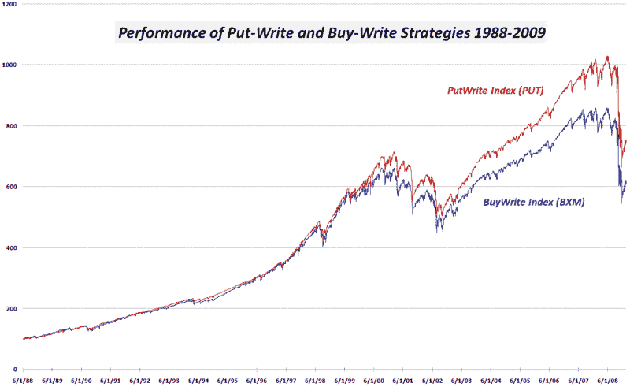
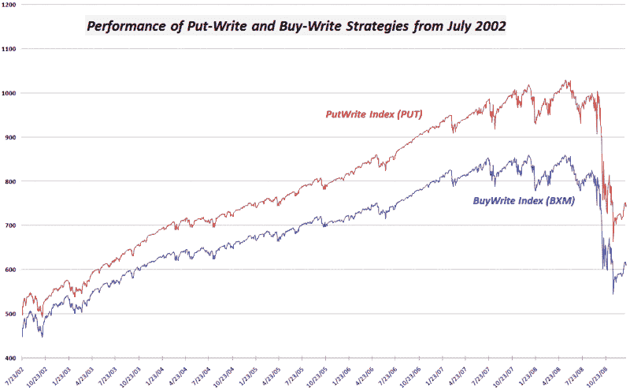

<!--yml
category: 未分类
date: 2024-05-18 18:06:38
-->

# VIX and More: Graphical Comparison of Performance of PutWrite and BuyWrite Indices

> 来源：[http://vixandmore.blogspot.com/2009/01/graphical-comparison-of-performance-of.html#0001-01-01](http://vixandmore.blogspot.com/2009/01/graphical-comparison-of-performance-of.html#0001-01-01)

I was pleased to see the strong response generated by Friday’s [The Often Overlooked Put Writing Strategy](http://vixandmore.blogspot.com/2009/01/often-overlooked-put-writing-strategy.html), particularly in some of the comments at Seeking Alpha, where the post was [republished](http://seekingalpha.com/article/114076-put-writing-too-often-overlooked). A number of questions came up regarding the reasons why two strategies that are synthetically equivalent (i.e. share the same profit and loss graph), would have different performance characteristics. I cited the main reason for the performance delta as the skew that results from a tendency to price puts higher than calls, particularly during times of extreme market stress, when demand for puts often exceeds the demand for calls.

I am not sure that I can prove beyond a reasonable doubt the skew hypothesis in this space, but I did assemble two performance graphs that might help to inform any further discussion. Using the CBOE PutWrite Index ([PUT](http://vixandmore.blogspot.com/search/label/PUT)) and the CBOE BuyWrite Index ([BXM](http://vixandmore.blogspot.com/search/label/BXM)) as my source data, I have plotted the two indices from their 1988 inception (above) and from 2002 (below), when the indices begin to substantially diverge.

From the two graphs, I find it interesting that the [put-write](http://vixandmore.blogspot.com/search/label/put-write) strategy begins to generate separation from the [buy-write](http://vixandmore.blogspot.com/search/label/buy-write) strategy during the 2002-07 bull market. As volatility increases during 2007, the put-write strategy continues to widen the gap, with the recent bear market having very little impact on the performance differential between the strategies.

Those who have any thoughts on the reasons behind the performance differential during different market cycles, please feel free to chime in.

*[source: CBOE, VIX and More]*