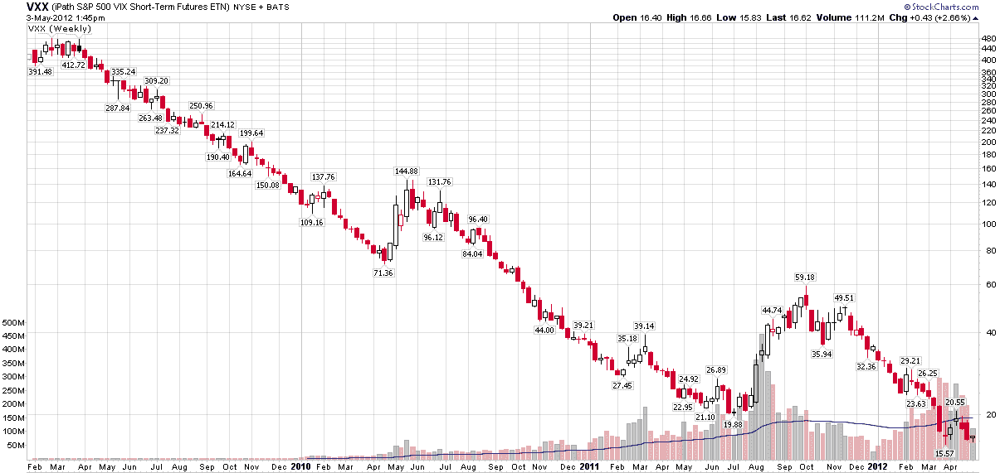

<!--yml
category: 未分类
date: 2024-05-18 16:31:08
-->

# VIX and More: Guest Columnist at The Striking Price for Barron’s: Why I Am Short Fear

> 来源：[http://vixandmore.blogspot.com/2012/05/guest-columnist-at-striking-price-for.html#0001-01-01](http://vixandmore.blogspot.com/2012/05/guest-columnist-at-striking-price-for.html#0001-01-01)

Today I am a guest columnist for *The Striking Price* on behalf of Steven Sears at [Barron’s](http://online.barrons.com/), weighing in with [Be Greedy While Others Are Fearful](http://online.barrons.com/article/SB50001424053111903935304577382010847832798.html?mod=BOL_hps_highlight_bottom).

The Barron’s article is a quick summary of some of the reasons I am short [fear](http://vixandmore.blogspot.com/search/label/fear). Essentially, I am short fear not because I have a Panglossian view of the world and am unconcerned about events in [Spain](http://vixandmore.blogspot.com/search/label/Spain), [China](http://vixandmore.blogspot.com/search/label/China), [Iran](http://vixandmore.blogspot.com/search/label/Iran) and other global flash points, but rather because fear is almost always overpriced – and by a wide margin. Between the [volatility risk premium](http://vixandmore.blogspot.com/search/label/volatility%20risk%20premium) and persistent negative [roll yield](http://vixandmore.blogspot.com/search/label/roll%20yield), long VIX strategies generally face an uphill battle.

I spell out the details of my thinking in the Barron’s article, but readers can find some similar themes in the links below.

Related posts:

A full list of my Barron’s contributions:

**

*[source(s): StockCharts.com]*

***Disclosure(s):*** *short VXX at time of writing*