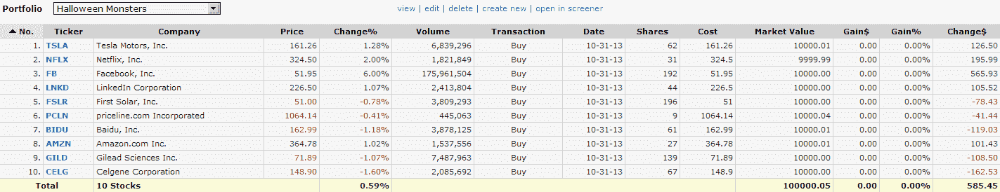

<!--yml
category: 未分类
date: 2024-05-18 16:12:31
-->

# VIX and More: Halloween Monsters

> 来源：[http://vixandmore.blogspot.com/2013/10/halloween-monsters.html#0001-01-01](http://vixandmore.blogspot.com/2013/10/halloween-monsters.html#0001-01-01)

In the spirit of the day and lacking the resources and imagination to do something as elaborate as the [Guillermo del Toro couch intro](http://www.youtube.com/watch?v=CtgYY7dhTyE) for the 2013 Treehouse of Horrors episode of The Simpsons (definitely worth a click through) I have elected instead to construct a portfolio of what I am calling the [Halloween Monsters](http://vixandmore.blogspot.com/search/label/Halloween%20Monsters) – a group of ten stocks that have been absolutely killing it this year, leading the markets higher.

The list includes the following familiar momentum names:

I intentionally left off Google (GOOG), in spite of an excellent 2013, largely because this behemoth now has a $346 billion market capitalization and there are some limits on how quickly on organization this size can grow.

With the inclusion of Baidu, the list reminded me a little of something I did back in October 2007, when I sensed a little too much froth in the stock market and created something I called the [OHFdex](http://vixandmore.blogspot.com/search/label/OHFdex), which began as a “watch list of Overripe High Fliers” and quickly evolved into an index designed to track 14 such stocks. When the markets turned down, the group was pummeled, with some [spectacular crashes](http://vixandmore.blogspot.com/2008/10/ohfdex-one-year-later.html) from the likes of CROCS ([CROX](http://vixandmore.blogspot.com/search/label/CROX)), Las Vegas Sands ([LVS](http://vixandmore.blogspot.com/search/label/LVS)), DryShips ([DRYS](http://vixandmore.blogspot.com/search/label/DRY)) and others.

The current list is certainly filled with high fliers, but whether they are overripe or capable of soaring higher is not as obvious as it was in October 2007 – at least for me. For that reason, I will keep a close eye on the Halloween Monsters portfolio going forward, as their movements will likely be a tip off as to where the broader markets are headed.

*[source(s): Finviz.com]*

At the very least, I expect the stocks on this list to offer some interesting fodder for the archives, just as the OHFdex did in 2007 and 2008\. Who knows, perhaps the next iteration of the OHFdex is just around the corner.

For more on the OHFdex and similar flights of fancy, check out the links below.

Related posts:

***Disclosure(s):*** *none*