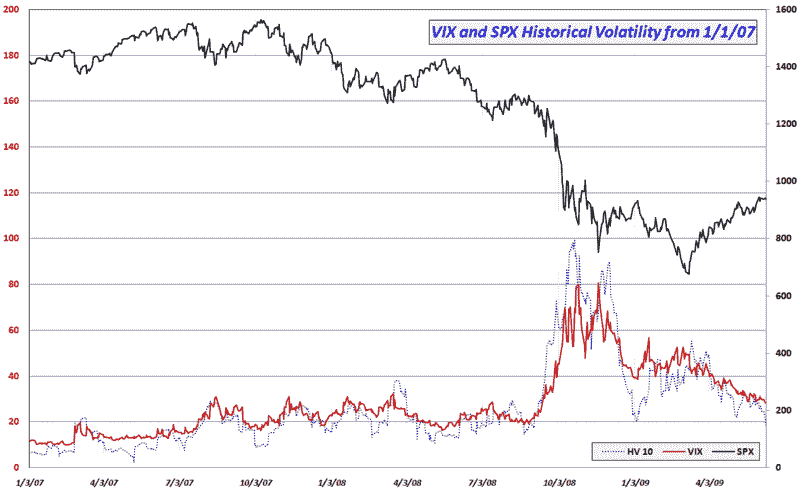

<!--yml
category: 未分类
date: 2024-05-18 17:43:34
-->

# VIX and More: Historical Volatility Continues to Plummet

> 来源：[http://vixandmore.blogspot.com/2009/06/historical-volatility-continues-to.html#0001-01-01](http://vixandmore.blogspot.com/2009/06/historical-volatility-continues-to.html#0001-01-01)

Further to this morning's pre-market post, [Volatility in Context with VIX at Pose-Lehman Low](http://vixandmore.blogspot.com/2009/06/volatility-in-context-with-vix-at-post.html), today’s 0.35% drop in the SPX means that it has now been four days since the S&P 500 index has moved more than 0.35%.

The range-bound trading is taking a heavy toll on [historical volatility](http://vixandmore.blogspot.com/search/label/historical%20volatility) (HV), with today’s action pushing the 10 day HV in the SPX down from 21.54 to 18.10 – the lowest reading since September 3, 2008.

The graphic below attempts to put the current historical volatility levels into the context of the past 2 ½ years. Note that the current 10 day HV of 18.10 fits right in the middle of the range for this measure during 2007 (a year of very low volatility) and the pre-Lehman portion of 2008\. In fact, given the recent historical record, I would be quite surprised to see 10 day HV fall any farther than the current level for at least another month or two.

Of course the VIX can continue to decline in the absence of falling volatility, but at some point historical volatility begins to provide some semblance of a floor below which the VIX is unlikely to remain.

On the other side of the coin, investors should also be aware that it has now been 26 sessions since the VIX was above the 35 level. If there is a catalyst (such [retail sales](http://vixandmore.blogspot.com/search/label/retail%20sales) numbers, [housing](http://vixandmore.blogspot.com/search/label/housing) data, [industrial production](http://vixandmore.blogspot.com/search/label/industrial%20production) statistics, Treasury auction results, the [FOMC](http://vixandmore.blogspot.com/search/label/FOMC) meeting in two weeks, etc.) that will change the volatility equation, then it is reasonable to look to 35 – not 40 or 50 – as the target for a VIX spike.

Finally, with volatility expectations shrinking almost on a daily basis, those who may be interested in speculative buying VIX out-of-the-money calls might find them a lot cheaper than anticipated – and perhaps a lot cheaper than they will be in another week or two.

*[graphic: VIXandMore]*