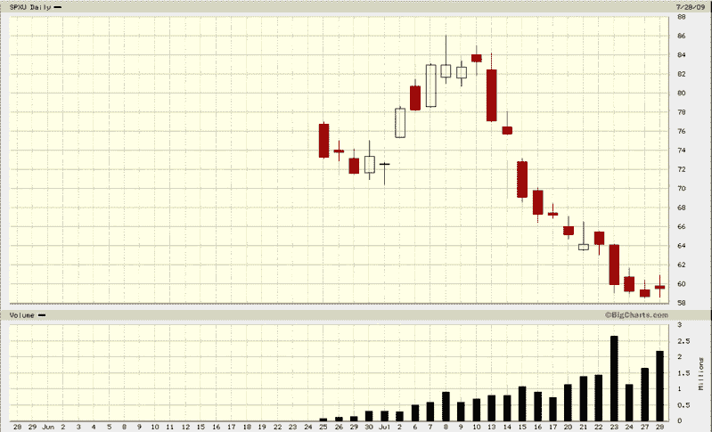

<!--yml
category: 未分类
date: 2024-05-18 17:36:29
-->

# VIX and More: How are SPXU and UPRO Being Traded?

> 来源：[http://vixandmore.blogspot.com/2009/07/how-are-spxu-and-upro-being-traded.html#0001-01-01](http://vixandmore.blogspot.com/2009/07/how-are-spxu-and-upro-being-traded.html#0001-01-01)

Yesterday, I did my best to be provocative in [Is the VIX Being Artificially Depressed by Increased Use of SPXU?](http://vixandmore.blogspot.com/2009/07/is-vix-being-artificially-depressed-by.html) One of the points I made is that [SPXU](http://vixandmore.blogspot.com/search/label/SPXU) could be a substitute for SPX puts (and perhaps artificially depress the VIX as a result) for those who are looking for leveraged ETFs as possible portfolio [hedge](http://vixandmore.blogspot.com/search/label/hedging). To be perfectly frank, I do not believe there will be substantial demand for SPXU (or any of the [triple ETFs](http://vixandmore.blogspot.com/search/label/triple%20ETFs)) as portfolio hedging vehicles, largely related to the issue of the compounding effect (see [Understanding the Impact of Changing Market Exposure on Leveraged ETFs](http://www.direxionshares.com/pdfs/Compounding_Article_ETFs.pdf) from [Direxion](http://vixandmore.blogspot.com/search/label/Direxion) for more details.)

In fact, when I predicted a bright future for SPXU and counterpart [UPRO](http://vixandmore.blogspot.com/search/label/UPRO) in [The Next Big Thing?](http://vixandmore.blogspot.com/2009/06/next-big-thing.html) back when they launched a month ago, I envisioned three primary uses for these triple ETFs:

1.  As a speculative short-term trading vehicle, with particular emphasis on day trading
2.  As part of various pairs trading schemes
3.  As part of the many arbitrage opportunities presented by all the large and growing family of SPX-based derivatives (futures, options, ETFs, leveraged ETFs, etc.)

While I did not envision SPXU as a viable hedging vehicle, this is largely because I was thinking in terms of a longer time frame for the hedge. If SPX puts can be utilized in increments of the one month options cycle, SPXU would be at a disadvantage trying to compete on a monthly time frame. I do believe, however, that SPXU can be a viable hedge for more than just a single trading session or an occasional two day sequence, as many have suggested. Depending on volatility levels, SPXU hedges can be left in place for up to three days with minimal risk of losses due to compounding. In my opinion, only when holding periods start to exceed four days does an SPXU hedge start to become inefficient.

With SPXU already having traded 2.3 million shares as I type this, the success of this product is now assured. While the value of SPXU as a hedging instrument pales in comparison to other possible applications, I do think SPXU can be used as an effective hedge for periods of 2-3 days at a time with an acceptable degree of compounding risk.

*[source: BigCharts]*

***Disclosure****: Long SPXU at time of writing.*