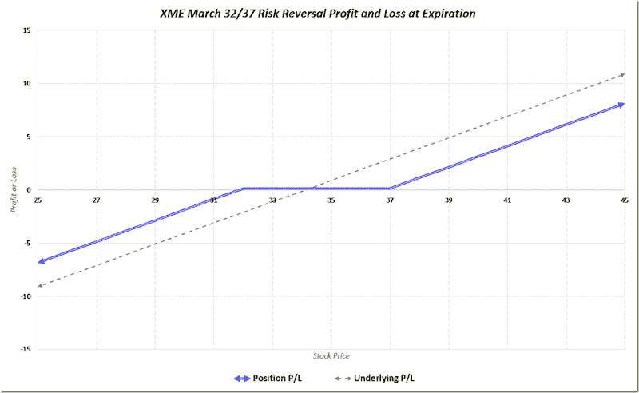

<!--yml
category: 未分类
date: 2024-05-18 16:09:58
-->

# VIX and More: How to Ride an Aging Bull (Guest Columnist at Barron’s)

> 来源：[http://vixandmore.blogspot.com/2014/11/how-to-ride-aging-bull-guest-columnist.html#0001-01-01](http://vixandmore.blogspot.com/2014/11/how-to-ride-aging-bull-guest-columnist.html#0001-01-01)

Yesterday marked the fifteenth time I have served as a guest columnist for [The Striking Price](http://online.barrons.com/public/search/results.html?HEADER_TEXT=The%20Striking%20Price%20Daily&article-doc-type=%7bThe+Striking+Price+Daily%7d&mod=BOL_article_full_more) at Barron’s and [How to Ride an Aging Bull](http://online.barrons.com/articles/how-to-ride-an-aging-bull-1417239597) is one of the few articles I have written for Barron’s that has not focused almost exclusively on the VIX and volatility.

In the Barron’s article I note that pundits have been calling this “the most hated bull market ever” for about three years and partly as a result of the mistrust of large bull moves, many retail investors have exited the market when they feared prices were getting ahead of themselves. As stocks have continued to rally, these same investors have had difficulty getting back in at even higher prices. Now, with 2015 just around the corner, quite a few of these investors believe stocks can continue to move higher and are wondering how they might be able to take advantage of a continued rally even though they believe the six-year bull is too long in the tooth.

An approach I discuss in the Barron’s article is one of seeking out value in underperforming sectors. In the article I cited the energy sector as the headline underperformer, but noted that while the energy sector ETP ([XLE](http://vixandmore.blogspot.com/search/label/XLE)) is down 8.5% year-to-date, the metals and mining sector ETP ([XME](http://vixandmore.blogspot.com/search/label/XME)) is down 18.7% for the year. *[Unfortunately, due to an editing snafu, the updated numbers I provided using data following the OPEC meeting were not incorporated into the publication.]*

The XME March 33/38 [risk reversal](http://vixandmore.blogspot.com/search/label/risk%20reversal) trade (short the March 33 put; long the March 38 call) cited in the Barron’s article uses strikes and prices that are quite stale now that OPEC has decided not to cut production. An updated version of the trade that would still generate a small credit would use the March 32 and 37 strikes, with a profit and loss chart that looks like the one below. Note that if XME is between 32 and 37 at expiration, the trade will generate a small profit. Should XME settle below 32 at expiration, the risk reversal (blue line) would lose about 2.24 less than holding the underlying (dotted gray line); if XME settles above 37 at expiration, the risk reversal gains would be about 2.76 less than if one had held the underlying.

*[source(s): VIXandMore]*

While metals and mining have had a difficult year, the recent rate cut by the People’s Bank of China and the anticipated near-term stimulus measures from the European Central Bank should provide a lift to metals and mining stocks. Other factors, including continued strong U.S. economic growth, could also bolster XME, which focuses mainly on steel, coal and aluminum for the U.S. market.

As noted in the Barron’s article, one could also make a similar trade with one of XME’s most liquid components, Alcoa ([AA](http://vixandmore.blogspot.com/search/label/AA)), where a short February 16/19 risk reversal has a similar profit and loss potential, yet taps into one of the metals and mining sectors, aluminum, that has been a very strong performer in 2014\. As Alcoa’s options market is more liquid than that of XME, the single-stock version of this risk reversal should be considered as an alternative way of achieving similar exposure.

Related posts:

A full list of my Barron’s contributions:

*   [How to Ride an Aging Bull](http://online.barrons.com/articles/how-to-ride-an-aging-bull-1417239597) (November 29, 2014)
*   [Investors' Best Options in a ‘No Fear’ Market](http://online.barrons.com/news/articles/SB50001424053111904248904580005080448123698) (July 2, 2014)
*   [Low Volatility: How to Profit from a Quiet VIX](http://online.barrons.com/news/articles/SB50001424053111904554304579577934289682884) (May 22, 2014)
*   [Emerging Market Stocks: Have They Hit Bottom?](http://online.barrons.com/article/SB50001424053111903536004579467372137029220.html) (March 28, 2014)
*   [How to Spot Risk Early](http://online.barrons.com/article/SB50001424052748704093404578609670858329206.html?mod=BOL_da_spd) (July 16, 2013)
*   [How to Insure Your Stock Portfolio](http://online.barrons.com/article/SB50001424052748703318404578430882101527030.html?mod=BOL_hps_highlight_mid) (April 18, 2013)
*   [The Case for Options Trading](http://online.barrons.com/article/SB50001424052748703792204578217484255589840.html?mod=BOL_hps_highlight_bottom) (January 2, 2013)
*   [Calm Down and Exploit Others’ Anxieties](http://online.barrons.com/article/SB50001424052748704526104578118984076144580.html) (November 14, 2012)
*   [How to Trade Options Around Volatile Events](http://online.barrons.com/article/SB50001424053111904184504577518802209654274.html) (July 10, 2012)
*   [Be Greedy While Others Are Fearful](http://online.barrons.com/article/SB50001424053111903935304577382010847832798.html?mod=BOL_hps_highlight_bottom) (May 3, 2012)
*   [Ways to Turn Volatility into an Asset Class](http://online.barrons.com/article/SB50001424052970204201404576077942647562616.html?mod=BOL_hps_dc) (January 12, 2011)
*   [There’s Opportunity in Uncertainty](http://online.barrons.com/article/SB50001424052970204743004575622694164710232.html) (November 18, 2010)
*   [Will Market Volatility Return to Crisis Levels?](http://online.barrons.com/article/SB50001424052970204297404575493863568455090.html) (September 15, 2010)
*   [The Perils of Predicting Volatility](http://online.barrons.com/article/SB127430948974994023.html) (May 20, 2010)
*   [Take a Longer View on Volatility](http://online.barrons.com/article/SB124648899704482887.html) (July 2, 2009)

***Disclosure(s):*** *none*