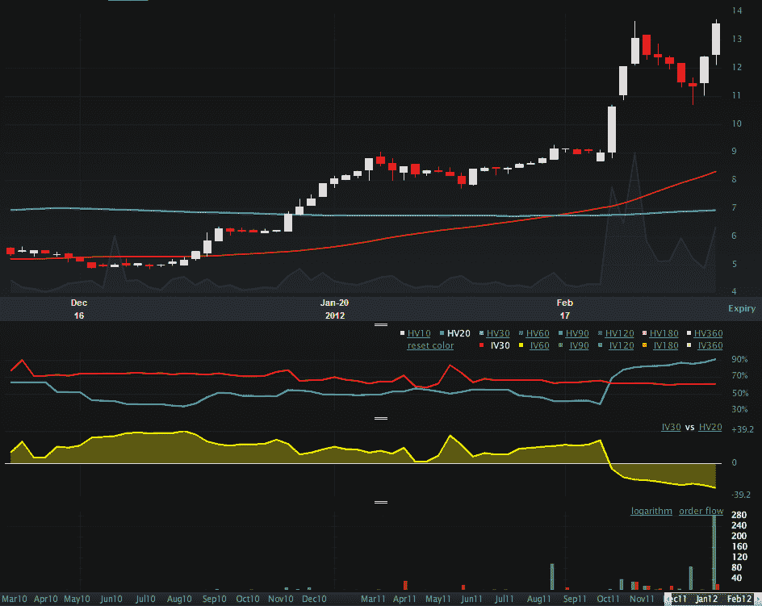

<!--yml
category: 未分类
date: 2024-05-18 16:36:27
-->

# VIX and More: IMOS Breaking Out, But Implied Volatility Fails to React

> 来源：[http://vixandmore.blogspot.com/2012/03/imos-breaking-out-but-implied.html#0001-01-01](http://vixandmore.blogspot.com/2012/03/imos-breaking-out-but-implied.html#0001-01-01)

While I generally trade more ETPs than single stocks, I am always keeping an eye on what is moving in the stock world, particularly in terms of new highs, as it helps inform some of my thinking in terms of bottoms up sector analysis. One of the stocks that recently hit my new high radar is ChipMOS Technologies (Bermuda) LTD ([IMOS](http://vixandmore.blogspot.com/search/label/IMOS)), a provider of total semiconductor testing and packaging solutions to fabless companies, integrated device manufacturers and foundries.

What I find particularly interesting about IMOS is that in spite of the fact that it has made new 52-week highs four times in the past two weeks on a huge spike in volume (gray area in upper chart) and [historical volatility](http://vixandmore.blogspot.com/search/label/historical%20volatility) (blue HV20 line) has jumped along with price, [implied volatility](http://vixandmore.blogspot.com/search/label/implied%20volatility) (red IV 30 line) appears to be completely indifferent to the big price move.

Now IMOS options are thinly traded, but still, this stock is clearly breaking out and finding some action from momentum traders. Frankly, I am not sure why IV has not responded. Perhaps options traders are certain that this breakout will fail and see no need to adjust their prices. A better bet, as far as I am concerned, is that HV is doing a better job of pricing future stock moves than IV right now, which makes IMOS options very cheap, even considering the reasonably wide bid-ask spreads. My guess is that the current HV 20 of 91 is a better estimate of future volatility than the current IV 30 of 62\. Either way, this could be an interesting breakout to watch – and perhaps even throw some options at.

Related posts:

**

*[source(s): LivevolPro.com]*

***Disclosure(s):*** *long IMOS at time of writing; Livevol is an advertiser on VIX and More*