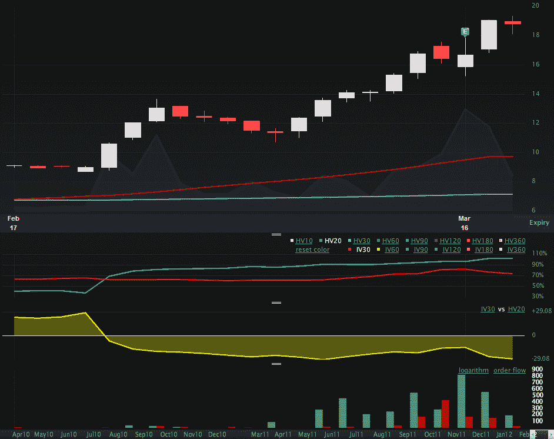

<!--yml
category: 未分类
date: 2024-05-18 16:35:43
-->

# VIX and More: IMOS Up 54% in Two Weeks; IV Still Lags HV

> 来源：[http://vixandmore.blogspot.com/2012/03/imos-up-54-in-two-weeks-iv-still-lags.html#0001-01-01](http://vixandmore.blogspot.com/2012/03/imos-up-54-in-two-weeks-iv-still-lags.html#0001-01-01)

ChipMOS Technologies (Bermuda) LTD ([IMOS](http://vixandmore.blogspot.com/search/label/IMOS)), is up 54% in two weeks and slightly less than that in the 12 days since I mentioned the stock in [IMOS Breaks Out, But Implied Volatility Fails to React](http://vixandmore.blogspot.com/2012/03/imos-breaking-out-but-implied.html).

While the company did report earnings last Friday, the stock did not appear to have an immediate reaction to that report. After trading in a wide range on Friday, the stock closed up 1.5%. Yesterday, however, it was off to the races again, with the stock up another 14%.

Part of what makes IMOS intriguing is the paucity of public information associated with this Taiwan-based company. As a result, the stock is highly responsive to technical factors and also has a high emotional component associated with the price action.

The last time around I posted about IMOS largely because I thought it was interesting that a stock which was breaking out ahead of earnings had such low [implied volatility](http://vixandmore.blogspot.com/search/label/implied%20volatility) (red IV 30 line) in spite of the fact that IMOS was now apparently “in play” at least in the minds of some investors. I commented at the time that “the current HV 20 of 91 is a better estimate of future volatility than the current IV 30 of 62.”

A little less than two weeks later, some interesting things have happened. In the one month chart below, once can see that IV 30 has risen to 75, even after accounting for the 10% decline following the earnings announcement. With [historical volatility](http://vixandmore.blogspot.com/search/label/historical%20volatility) (blue HV20 line) now at 102, implied volatility still looks like a conservative estimate of the potential future moves in IMOS, particularly when one considers that daily trading volumes are now running at about five times the three month average.

Options volume has also picked up dramatically and almost all of the action has been on the call side.

In terms of trading, this is the type of freight train that I generally prefer not to step in front of, but having closed out my long positions, I now find that there are a couple of defined risk trades on the short side that have some potential.

Related posts:

**

*[source(s): LivevolPro.com]*

***Disclosure(s):*** *short IMOS at time of writing; Livevol is an advertiser on VIX and More*