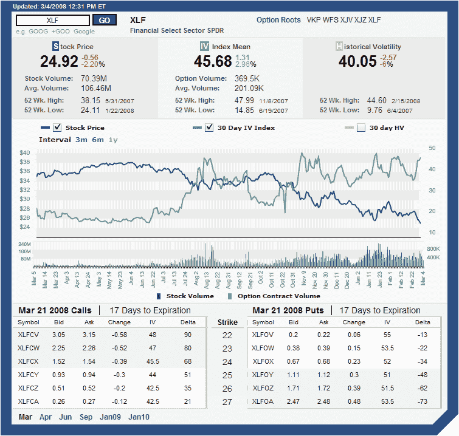

<!--yml
category: 未分类
date: 2024-05-18 18:41:36
-->

# VIX and More: ISE Implied Volatility Charts

> 来源：[http://vixandmore.blogspot.com/2008/03/ise-implied-volatility-charts.html#0001-01-01](http://vixandmore.blogspot.com/2008/03/ise-implied-volatility-charts.html#0001-01-01)

When it comes to [implied volatility](http://vixandmore.blogspot.com/search/label/implied%20volatility) charts, I normally use the charts from two of my favorite options brokers: [thinkorswim](http://www.thinkorswim.com/) and [optionsXpress](http://optionsxpress.com/).  On the other hand, this blog is littered with IV charts from [iVolatility.com](http://www.ivolatility.com/), largely because these charts are freely available on the web and because the look and feel is relatively clean and uncluttered.

For a visual change of pace, I suspect I will soon start posting some of the excellent thinkorswim charts, but for those wishing to roll their own, I want to offer a strong recommendation for the implied volatility charts put out by the [ISE](http://vixandmore.blogspot.com/search/label/ISE).  When it comes to the [ISEE](http://vixandmore.blogspot.com/search/label/ISEE) charts on the ISE site, I am often frustrated by the poor graphics, but the ISE charts for individual securities are excellent.  An example of one of the ISE’s volatility charts is the one I have included for [XLF](http://vixandmore.blogspot.com/search/label/XLF) below.  These charts can be customized to a time frame of 3 months, 6 months or 12 months and allow users to specify, via check boxes, any of stock price, implied volatility, and 30 day historical volatility (I have historical volatility turned off here.)  As you can see from the graphic below, there is a lot of information crammed into these charts, including daily stock and option volume (easier to read in the shorter time frames), as well as a fair amount of volatility data.  All data is delayed by 20 minutes, but as far as I am concerned these are the best free volatility charts out there.

To generate your own volatility charts at ISE, try their [Quotes/Volatility page](http://www.ise.com/WebForm/md_livevol.aspx?categoryId=124&header3=true&menu1=true).

[source: International Securities Exchange]